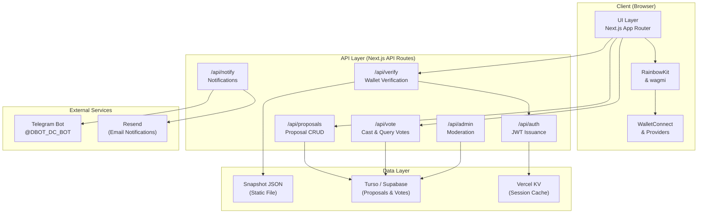
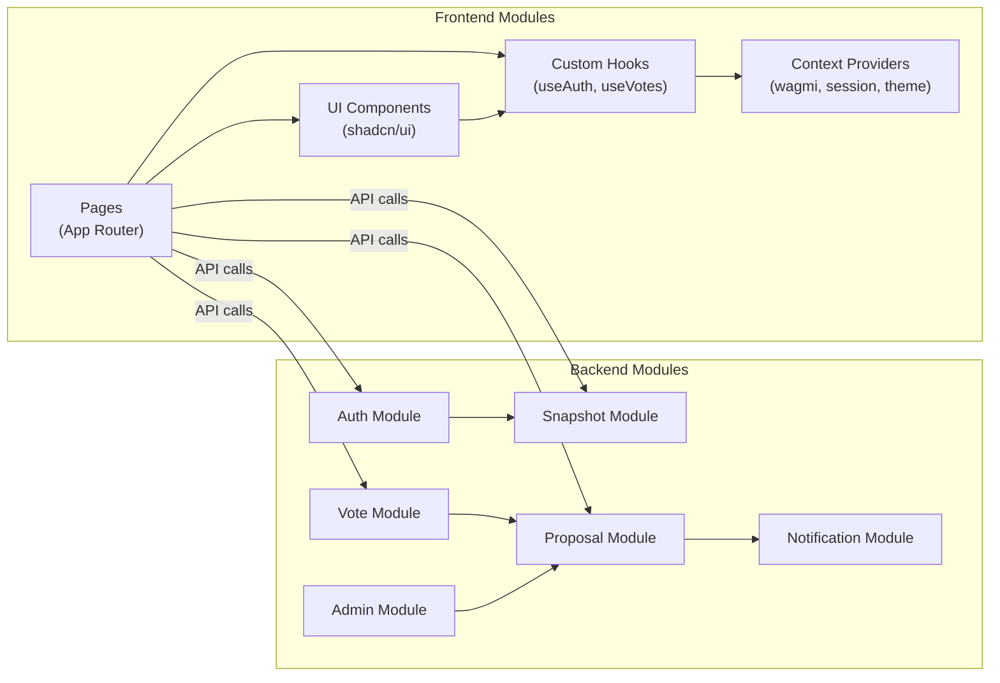
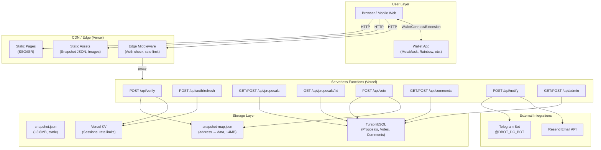
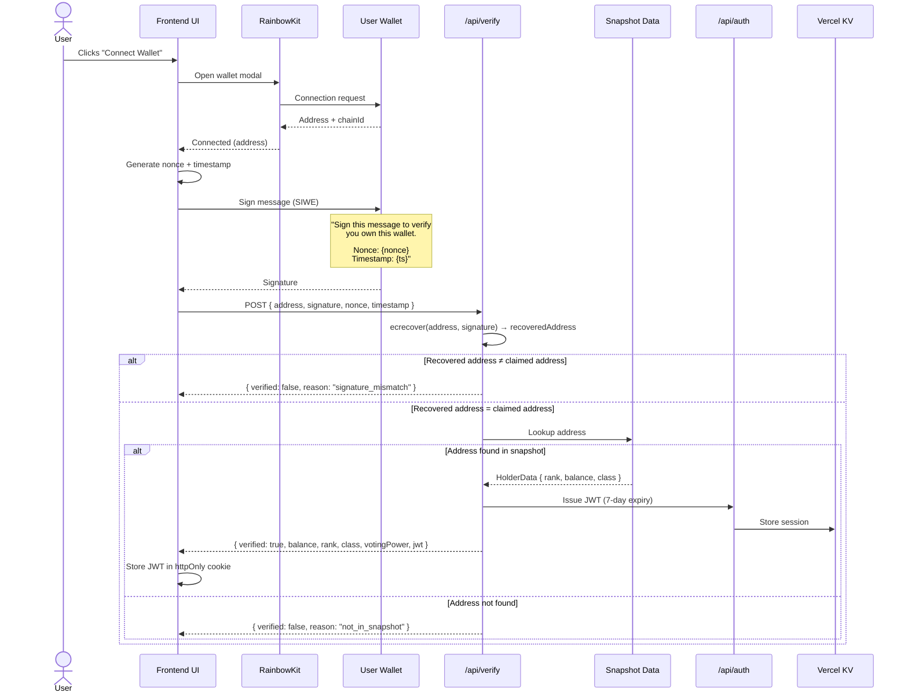
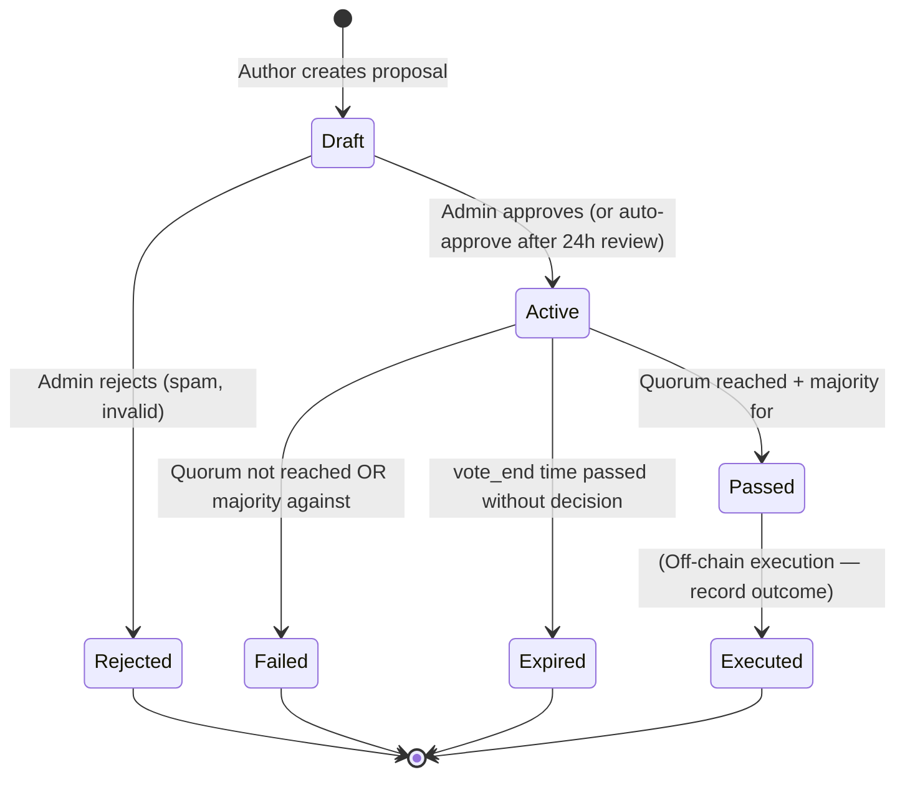

# $OMNOM DAO Governance Platform — Technical & UX Design Document

| Field | Value |
|---|---|
| **Version** | 1.0.0 |
| **Author** | DBOT / OMNOM DAO Core Team |
| **Date** | 2026-06-23 |
| **Status** | Draft — Under Review |
| **Project** | $OMNOM DAO Governance Platform |
| **Repository** | TBD |
| **License** | MIT (Open Source) |

---

## Table of Contents

1. [Project Overview](#1-project-overview)
2. [Architecture Overview](#2-architecture-overview)
3. [Tech Stack Recommendations](#3-tech-stack-recommendations)
4. [System Architecture (Detailed)](#4-system-architecture-detailed)
5. [Data Flow — Wallet Verification](#5-data-flow--wallet-verification)
6. [UI/UX Design Direction](#6-uiux-design-direction)
7. [Page-by-Page Screen Descriptions](#7-page-by-page-screen-descriptions)
8. [Security Design](#8-security-design)
9. [Performance Considerations](#9-performance-considerations)
10. [Phased Roadmap](#10-phased-roadmap)
11. [Appendix](#11-appendix)

---

## 1. Project Overview

### 1.1 Context

$OMNOM is a DRC-20 token originally deployed on Dogechain (chain ID 2000). Following the Dogechain sunset announcement (post June 7, 2026), the blockchain is no longer live. All governance must therefore operate **off-chain** using a frozen snapshot of token holdings.

**Key Facts:**

- **Snapshot Date:** June 7, 2026 23:59:58 UTC
- **Snapshot Block:** 59,922,100
- **Total Holders:** 25,431
- **Contract:** `0xe3fcA919883950c5cD468156392a6477Ff5d18de`
- **Decimals:** 18
- **Vitalik Burn:** 68.9% of supply
- **Telegram Group:** t.me/omnomtoken_dc
- **Telegram Bot:** @DBOT_DC_BOT

### 1.2 Holder Classes

| Class | Threshold | Count | Emoji | Voting Power Modifier |
|---|---|---|---|---|
| 🐋 Whale | ≥ 1.00% of supply | 4 | 🐋 | 1× (balance-weighted) |
| 🐬 Dolphin | ≥ 0.01% of supply | 322 | 🐬 | 1× (balance-weighted) |
| 🐟 Fish | < 0.01% of supply | 25,105 | 🐟 | 1× (balance-weighted) |

> **Note:** All holders vote proportionally to their token balance (1 token = 1 vote). The class badges are cosmetic/social and do not modify voting power. This may change in v2.0 with quadratic voting.

### 1.3 Snapshot Data Format

The snapshot CSV contains the following columns:

```
rank, address, balance_raw, balance_formatted, percentage_of_supply
```

Example row:

```
1, 0xabc123..., 68900000000000000000000, 68900.0, 13.78
```

### 1.4 Design Constraints

- **No live blockchain** — all verification is off-chain against the snapshot
- **Open-source** — all code public, community-auditable
- **Low-cost hosting** — free or near-free infrastructure
- **Mobile-first** — 60%+ of crypto users access via mobile
- **Read-only wallets** — no gas fees, no token transfers, no private key access

---

## 2. Architecture Overview

### 2.1 High-Level Architecture



### 2.2 Architectural Decision: Frontend-Only vs API Server

**Decision: Next.js with API Routes + Static Snapshot Data**

| Approach | Pros | Cons | Verdict |
|---|---|---|---|
| Pure static (SPA) | Simplest deployment, free hosting | Cannot do server-side signature verification securely; secret logic exposed in client | ❌ Rejected |
| Next.js with API Routes | Server-side verification, SSR/SSG/ISR, single deploy unit, API routes for sensitive ops | Slightly more complex than pure static | ✅ **Recommended** |
| Separate backend (Node/Go) | Clean separation, language flexibility | Extra infra, extra deploy pipeline, CORS management, higher cost | ❌ Overkill for scope |

**Rationale:** The only "sensitive" operations are wallet signature recovery (`ecrecover`) and vote writing. Both fit naturally in Next.js API routes with zero additional infrastructure. Static snapshot data can be embedded at build time or served as a public JSON file.

### 2.3 Data Flow Summary

```
User → Wallet Sign → API verifies signature → API looks up address in snapshot → Returns holder data → UI renders
```

### 2.4 Component Diagram



---

## 3. Tech Stack Recommendations

### 3.1 Frontend Framework

| Option | Pros | Cons | Verdict |
|---|---|---|---|
| **Next.js 15 (App Router)** | SSG/ISR/SSR flexibility; built-in API routes; excellent DX; Vercel native; React Server Components; great image optimization | Locked into React ecosystem; App Router still maturing | ✅ **Recommended** |
| Nuxt 3 | Vue ecosystem; similar SSG/SSR; Nitro server engine | Smaller ecosystem for Web3 libraries; fewer wallet connection libs for Vue | ❌ |
| Create React App | Simple, well-known | No SSR/SSG; deprecated; no API routes; poor performance defaults | ❌ |

**Recommendation: Next.js 15 with App Router**

- SSG for proposal pages (fast loads, SEO-friendly)
- ISR with 60s revalidation for active-vote pages
- API routes for wallet verification, vote casting, proposal CRUD
- React Server Components for data-fetching pages (no client JS for initial render)

```json
// next.config.js highlights
{
  "experimental": {
    "serverActions": true
  },
  "images": {
    "formats": ["image/avif", "image/webp"]
  }
}
```

### 3.2 Wallet Connection

| Option | Pros | Cons | Verdict |
|---|---|---|---|
| **RainbowKit v2 + wagmi v3 + viem** | Best DX; beautiful modal; multi-chain; built-in session; connect once, sign once; great docs | RainbowKit branding (customizable); React-only | ✅ **Recommended** |
| Web3Modal (WalletConnect) | Chain-agnostic; simple setup | Less polished UI; fewer customization options; wagmi integration is secondary | ❌ |
| Custom WalletConnect | Full control | Massive effort to build reliable modal; reinventing the wheel | ❌ |

**Recommendation: RainbowKit v2 + wagmi v3 + viem**

**Supported Wallets:**
- MetaMask (browser extension, most popular)
- WalletConnect v2 (mobile wallets — Trust, Rainbow, etc.)
- Coinbase Wallet
- Phantom (Solana crossover users)
- Rabby, Frame, and other EVM wallets

**Chain Configuration:**

Since we only need the user's address (no on-chain calls), we configure a minimal read-only chain. Users can connect from any chain — we don't switch their network.

```typescript
// wagmi config — src/config/wagmi.ts
import { getDefaultConfig } from '@rainbow-me/rainbowkit';
import { defineChain } from 'viem';

// Custom read-only "Dogechain Snapshot" chain for display purposes
export const dogechainSnapshot = defineChain({
  id: 2000,
  name: 'Dogechain (Snapshot)',
  nativeCurrency: {
    name: 'DOGE',
    symbol: 'DOGE',
    decimals: 18,
  },
  rpcUrls: {
    default: { http: ['https://rpc.dogechain.dog'] },
  },
  blockExplorers: {
    default: { name: 'Dogechain Explorer', url: 'https://explorer.dogechain.dog' },
  },
});

export const config = getDefaultConfig({
  appName: '$OMNOM DAO',
  projectId: process.env.NEXT_PUBLIC_WC_PROJECT_ID!, // WalletConnect Cloud
  chains: [dogechainSnapshot],
  // Allow connections from ANY chain — we only care about the address
  ssr: true,
});
```

### 3.3 Data Storage

| Option | Pros | Cons | Verdict |
|---|---|---|---|
| **Static JSON + Turso SQLite** | Zero cost for snapshot; fast O(1) lookups; Turso is free tier friendly; embedded libSQL; edge-deployable | Two storage systems to manage | ✅ **Recommended** |
| Static JSON + Supabase PostgreSQL | Generous free tier; great dashboard; real-time subscriptions; Row Level Security | Heavier than needed; PostgreSQL overkill for simple vote records; cold starts on free tier | ❌ (acceptable alt) |
| All IPFS | Decentralized, immutable | Slow reads; no writable storage; complex pinning; UX nightmare for mutable data | ❌ |
| All SQLite (local) | Simple | Serverless functions are stateless; no shared state across instances | ❌ |

**Recommendation: Static JSON for Snapshot + Turso (libSQL) for Proposals/Votes**

**Snapshot Storage:**

```typescript
// Snapshot data structure — generated at build time from CSV
interface HolderData {
  rank: number;
  address: string;        // lowercase, checksummed
  balance_raw: string;    // raw wei amount
  balance_formatted: string; // human-readable
  percentage_of_supply: string;
  class: 'whale' | 'dolphin' | 'fish';
}

// At build time: create a Map for O(1) lookup
// Exported as JSON: { "0xabc...": HolderData, ... }
// File size estimate: ~25,431 entries × ~150 bytes ≈ 3.8 MB (uncompressed)
// With gzip: ~800 KB — served as static asset
```

**Proposals/Votes Storage (Turso Schema):**

```sql
-- proposals table
CREATE TABLE proposals (
  id TEXT PRIMARY KEY,              -- UUID
  title TEXT NOT NULL,
  description TEXT NOT NULL,        -- Markdown content
  proposal_type TEXT NOT NULL,      -- 'governance' | 'treasury' | 'community' | 'technical'
  author_address TEXT NOT NULL,     -- checksummed
  status TEXT NOT NULL DEFAULT 'draft',  -- draft, active, passed, failed, expired
  vote_start INTEGER NOT NULL,       -- Unix timestamp
  vote_end INTEGER NOT NULL,         -- Unix timestamp
  quorum_percentage REAL NOT NULL DEFAULT 5.0,  -- % of total supply needed
  created_at INTEGER NOT NULL,
  updated_at INTEGER NOT NULL,
  FOREIGN KEY (author_address) REFERENCES snapshot(address)
);

-- votes table
CREATE TABLE votes (
  proposal_id TEXT NOT NULL,
  voter_address TEXT NOT NULL,
  choice TEXT NOT NULL,              -- 'for' | 'against' | 'abstain'
  voting_power REAL NOT NULL,         -- snapshot balance at time of vote
  created_at INTEGER NOT NULL,
  PRIMARY KEY (proposal_id, voter_address),  -- one vote per proposal per address
  FOREIGN KEY (proposal_id) REFERENCES proposals(id)
);

-- comments table
CREATE TABLE comments (
  id TEXT PRIMARY KEY,
  proposal_id TEXT NOT NULL,
  author_address TEXT NOT NULL,
  content TEXT NOT NULL,
  created_at INTEGER NOT NULL,
  FOREIGN KEY (proposal_id) REFERENCES proposals(id)
);
```

### 3.4 Hosting

| Option | Pros | Cons | Verdict |
|---|---|---|---|
| **Vercel** | Next.js native; edge functions; automatic HTTPS; preview deployments; generous free tier (100GB BW, serverless); built-in analytics | Vendor lock-in; cold starts on hobby plan; build time limits | ✅ **Recommended** |
| Cloudflare Pages | Global edge; zero cold starts; unlimited bandwidth (free!) | No native Next.js API route support on free plan (Workers needed separately); more complex setup | ❌ (good but more work) |
| Netlify | Good DX; generous free tier | No native Next.js edge runtime support; Functions have 10s timeout; less performant for Next.js | ❌ |

**Recommendation: Vercel (Hobby Plan — Free)**

- Frontend: Static + ISR pages served from edge
- API: Serverless functions (Node.js runtime)
- Snapshot JSON: Stored in `/public/data/` — served as static asset, cached at edge
- Database: Turso (separate free tier, edge-deployed libSQL)

### 3.5 Styling & UI Library

| Option | Pros | Cons | Verdict |
|---|---|---|---|
| **Tailwind CSS + shadcn/ui** | Best DX; tiny bundle (tree-shaken); dark mode built-in; accessible; copy-paste components (you own the code); highly customizable | Requires Tailwind knowledge; component library is copied into project (not a dep) | ✅ **Recommended** |
| Chakra UI | Good DX; accessible; component-based | Larger bundle; opinionated styling; less flexible | ❌ |
| MUI (Material UI) | Mature; comprehensive; enterprise-grade | Large bundle; React-heavy; "Google look" doesn't fit crypto aesthetic | ❌ |

**Recommendation: Tailwind CSS v4 + shadcn/ui**

Additional UI libraries:
- **framer-motion** — page transitions, vote animations, confetti
- **react-markdown** — proposal description rendering
- **react-hot-toast** — toast notifications
- **lucide-react** — icon set (lightweight, tree-shakeable)
- **react-confetti** — celebration effects on proposal creation

---

## 4. System Architecture (Detailed)

### 4.1 Overall System Architecture



### 4.2 Data Flow Diagram — Wallet Verification



### 4.3 Proposal Lifecycle State Machine



**State Descriptions:**

| State | Description | Duration | Transitions |
|---|---|---|---|
| **Draft** | Proposal submitted, awaiting admin review | Up to 24h (auto-approve) | → Active, → Rejected |
| **Active** | Open for voting | `vote_end - vote_start` (default 7 days) | → Passed, → Failed, → Expired |
| **Passed** | Quorum reached AND majority voted "for" | Permanent | → Executed |
| **Failed** | Quorum not met OR majority voted "against" | Permanent | → [end] |
| **Expired** | Voting period ended without meeting quorum | Permanent | → [end] |
| **Rejected** | Admin rejected (spam, duplicate, invalid) | Permanent | → [end] |
| **Executed** | Outcome recorded (off-chain action taken) | Permanent | → [end] |

### 4.4 Component Hierarchy

```mermaid
graph TD
    RootLayout["RootLayout<br/>(ThemeProvider, WagmiProvider, SessionProvider)"]
    Header["Header<br/>(Logo, Nav, ConnectWallet, ThemeToggle)"]
    Sidebar["Sidebar<br/>(Desktop Navigation)"]
    BottomNav["BottomNav<br/>(Mobile Navigation)"]
    HomePage["HomePage"]
    ProposalListPage["ProposalListPage"]
    ProposalDetailPage["ProposalDetailPage"]
    CreateProposalPage["CreateProposalPage"]
    DashboardPage["DashboardPage"]
    SettingsPage["SettingsPage"]

    RootLayout --> Header
    RootLayout --> Sidebar
    RootLayout --> BottomNav
    RootLayout --> HomePage
    RootLayout --> ProposalListPage
    RootLayout --> ProposalDetailPage
    RootLayout --> CreateProposalPage
    RootLayout --> DashboardPage
    RootLayout --> SettingsPage

    subgraph HomePage ["Home Page Components"]
        HeroSection["HeroSection"]
        StatsBar["StatsBar<br/>(Total Holders, Active Proposals, etc.)"]
        RecentProposals["RecentProposals"]
        CTAConnect["CTAConnect"]
    end

    subgraph ProposalListPage ["Proposal List Components"]
        ProposalFilters["ProposalFilters<br/>(Status, Type, Sort)"]
        ProposalCard["ProposalCard × N"]
        EmptyState["EmptyState"]
    end

    subgraph ProposalDetailPage ["Proposal Detail Components"]
        ProposalHeader["ProposalHeader<br/>(Title, Status Badge, Author)"]
        ProposalBody["ProposalBody<br/>(Markdown Renderer)"]
        VotePanel["VotePanel<br/>(For / Against / Abstain)"]
        VoteBreakdown["VoteBreakdown<br/>(Progress bars)"]
        VoterList["VoterList<br/>(Paginated)"]
        Timeline["Timeline<br/>(Proposal lifecycle)"]
        CommentsSection["CommentsSection"]
        StickyVoteButton["StickyVoteButton"]
    end

    HomePage --> HeroSection
    HomePage --> StatsBar
    HomePage --> RecentProposals
    HomePage --> CTAConnect
    ProposalListPage --> ProposalFilters
    ProposalListPage --> ProposalCard
    ProposalListPage --> EmptyState
    ProposalDetailPage --> ProposalHeader
    ProposalDetailPage --> ProposalBody
    ProposalDetailPage --> VotePanel
    ProposalDetailPage --> VoteBreakdown
    ProposalDetailPage --> VoterList
    ProposalDetailPage --> Timeline
    ProposalDetailPage --> CommentsSection
    ProposalDetailPage --> StickyVoteButton
```



### 4.5 Module Descriptions

#### Snapshot Module

**Purpose:** Load and serve frozen holder data from the June 7, 2026 snapshot.

**Implementation:**
- Build script (`scripts/build-snapshot.ts`) reads CSV, validates, converts to JSON
- Two output files:
  - `public/data/snapshot.json` — sorted array (for paginated listing, analytics)
  - `public/data/snapshot-map.json` — object keyed by lowercase address (for O(1) lookup)
- API route (`/api/verify`) loads snapshot-map into memory on first request (cached)
- Snapshot hash (SHA-256 of original CSV) stored in `public/data/snapshot-hash.txt` and displayed on site for verification

**API Interface:**
```typescript
// Internal — not exposed as API route
class SnapshotService {
  private data: Map<string, HolderData> | null = null;

  async load(): Promise<void> {
    // Load snapshot-map.json into memory Map
  }

  findByAddress(address: string): HolderData | null {
    return this.data?.get(address.toLowerCase()) ?? null;
  }

  getStats(): SnapshotStats {
    return { totalHolders: 25431, totalSupply: "...", whaleCount: 4, ... };
  }
}
```

#### Auth Module

**Purpose:** Verify wallet ownership and manage sessions.

**Implementation:**
- SIWE pattern (Sign-In with Ethereum) — user signs a message with their wallet
- Server recovers the signer address using `ecrecover` (via viem's `verifyMessage`)
- JWT issued on successful verification:
  - Payload: `{ sub: address, iat, exp: now + 7 days, class, rank }`
  - Signed with `JWT_SECRET` (env var)
  - Stored in httpOnly cookie (`omnom-session`)
- Session refresh: POST `/api/auth/refresh` — extends JWT if valid and not expired
- Logout: clear cookie

**API Routes:**
```
POST /api/verify    — Verify signature + lookup snapshot → issue JWT
POST /api/auth/refresh — Refresh existing JWT
POST /api/auth/logout   — Clear session
```

#### Proposal Module

**Purpose:** CRUD operations for governance proposals.

**Implementation:**
- Server Actions (Next.js) for mutations (create, update status)
- GET endpoints for listing and detail (ISR-friendly)
- Proposal validation: title length, description length, valid vote period, quorum threshold
- Author must be a verified holder (JWT required)
- Auto-transition: cron job (Vercel Cron) checks for expired proposals every 5 minutes

**API Routes:**
```
GET    /api/proposals          — List proposals (paginated, filterable)
GET    /api/proposals/:id      — Single proposal with vote summary
POST   /api/proposals          — Create proposal (auth required)
PATCH  /api/proposals/:id      — Update proposal (author only, draft state only)
POST   /api/proposals/:id/status — Admin: change status (approve/reject)
```

#### Vote Module

**Purpose:** Cast and tally votes.

**Implementation:**
- One vote per proposal per address (DB primary key constraint)
- Vote must be cast during active period (`vote_start ≤ now ≤ vote_end`)
- Voter must be in snapshot (JWT verified)
- `voting_power` stored at vote time (frozen from snapshot — cannot change)
- Real-time tally: computed from DB on read (no separate counter to avoid drift)
- Vote choices: `for`, `against`, `abstain`

**API Routes:**
```
POST   /api/vote               — Cast vote { proposalId, choice }
GET    /api/votes/:proposalId  — List votes (paginated, with voter addresses)
DELETE /api/vote/:proposalId   — Change vote (before deadline, replaces existing)
```

**Result Calculation:**
```typescript
interface VoteResult {
  for: number;       // sum of voting_power
  against: number;
  abstain: number;
  quorum: number;    // sum of for + against + abstain
  quorumRequired: number; // total_supply × quorum_percentage
  passed: boolean;   // quorum met AND for > against
}
```

#### Notification Module

**Purpose:** Alert holders about proposal events.

**Implementation:**
- **Telegram:** Webhook integration with @DBOT_DC_BOT — sends messages to group on:
  - New proposal created
  - Proposal moved to Active
  - Proposal outcome (Passed/Failed/Expired)
  - 24h before proposal expires
- **Email (optional, v1.1):** Resend API for:
  - Proposal created (opt-in)
  - Vote reminder (24h before expiry)
  - Proposal outcome

**API Routes:**
```
POST   /api/notify/telegram    — Send Telegram message (internal)
POST   /api/notify/email       — Send email (internal)
POST   /api/notify/preferences — Update notification prefs (auth)
```

#### Admin Module

**Purpose:** Proposal moderation and platform analytics.

**Implementation:**
- Admin addresses stored in env var (`NEXT_PUBLIC_ADMIN_ADDRESSES` — comma-separated)
- Admin functions:
  - Approve/reject draft proposals
  - View analytics (voter turnout, holder participation rate)
  - Spam detection (duplicate proposals, suspicious patterns)
  - Manual proposal status override (emergency use only)
- Admin UI accessible only to whale/dolphin holders (configurable)

**API Routes:**
```
GET    /api/admin/stats         — Platform analytics
POST   /api/admin/proposals/:id/approve  — Approve draft
POST   /api/admin/proposals/:id/reject   — Reject draft
GET    /api/admin/proposals     — All proposals (including drafts)
```

---

## 5. Data Flow — Wallet Verification

### 5.1 Detailed Verification Sequence

This is the critical user flow — the first thing every user experiences. It must be fast, clear, and trustworthy.

#### Step 1: User initiates connection

- User lands on the site, sees hero section with "Connect Wallet & Vote" CTA
- Clicks the button → RainbowKit modal opens
- User selects their wallet (MetaMask, WalletConnect, Coinbase, etc.)

#### Step 2: Wallet connected (address obtained)

- RainbowKit returns the connected address
- UI shows truncated address in header: `0x1234...5678`
- UI displays a "Verify Holder Status" button

#### Step 3: Sign verification message

- Frontend generates:
  ```typescript
  const nonce = crypto.randomUUID();
  const timestamp = Date.now();
  const message = `Sign this message to verify you own this wallet.\n\nThis does not cost any gas or transfer any tokens.\n\nNonce: ${nonce}\nTimestamp: ${timestamp}`;
  ```
- Frontend calls `wagmi.useSignMessage({ message })`
- User's wallet shows the message for signing
- User confirms → signature returned

#### Step 4: Server verification

- Frontend POSTs to `/api/verify`:
  ```json
  {
    "address": "0x1234...5678",
    "signature": "0xabcdef...",
    "nonce": "uuid-here",
    "timestamp": 1717776000000
  }
  ```

#### Step 5: ecrecover

- Server uses viem to recover the signer:
  ```typescript
  import { verifyMessage } from 'viem';

  const recoveredAddress = await verifyMessage({
    address: claimedAddress,
    message: expectedMessage,
    signature,
  });
  ```
- If `recoveredAddress.toLowerCase() === claimedAddress.toLowerCase()` → signature valid

#### Step 6: Snapshot lookup

- Server looks up `address.toLowerCase()` in snapshot map
- If found: returns holder data
- If not found: returns "not in snapshot" with explanation

#### Step 7: JWT issuance & response

- Success response:
  ```json
  {
    "verified": true,
    "holder": {
      "address": "0x1234...5678",
      "rank": 42,
      "balance": "1,234.567",
      "balanceRaw": "1234567000000000000",
      "percentageOfSupply": "0.025",
      "class": "dolphin",
      "classEmoji": "🐬",
      "votingPower": 1234.567
    },
    "jwt": "eyJhbGciOi..."
  }
  ```
- Not found response:
  ```json
  {
    "verified": false,
    "reason": "not_in_snapshot",
    "message": "This address was not found in the June 7, 2026 snapshot. It may have acquired $OMNOM after the snapshot date, or the address may be incorrect."
  }
  ```

#### Step 8: Session storage

- JWT stored in httpOnly, secure, SameSite=Lax cookie named `omnom-session`
- 7-day expiry
- Subsequent requests: middleware checks cookie, validates JWT, attaches `holder` to request

#### Step 9: Return visits

- User visits site → middleware reads cookie → validates JWT → if valid, no re-signing needed
- JWT expired → user sees "Session expired, please reconnect" prompt
- Nonce tracking: server stores used nonces in Vercel KV (TTL: 5 min) to prevent replay attacks

### 5.2 Sequence Diagram

*(See Section 4.2 for the full Mermaid sequence diagram)*

---

## 6. UI/UX Design Direction

### 6.1 Visual Identity

#### Color Palette

| Token | Hex | Usage |
|---|---|---|
| `--gold` / Primary | `#FFD700` | CTAs, active states, highlights, $OMNOM branding |
| `--purple` / Secondary | `#8B5CF6` | DBOT brand, secondary buttons, links |
| `--bg-deep` / Background | `#0F0F23` | Page background |
| `--bg-surface` / Surface | `#1A1A2E` | Cards, modals, panels |
| `--bg-elevated` / Elevated | `#252540` | Hover states, active cards |
| `--green` / Success | `#10B981` | Passed proposals, positive indicators |
| `--red` / Danger | `#EF4444` | Failed proposals, error states, "Against" votes |
| `--amber` / Warning | `#F59E0B` | Expiring soon, caution states |
| `--text-primary` | `#F8FAFC` | Main body text |
| `--text-muted` | `#94A3B8` | Secondary text, labels, timestamps |
| `--text-dim` | `#64748B` | Disabled text, placeholders |
| `--border` | `#2D2D4A` | Card borders, dividers |

#### Typography

```css
/* Font loading */
@import url('https://fonts.googleapis.com/css2?family=Inter:wght@400;500;600;700;800&family=JetBrains+Mono:wght@400;500;600&display=swap');

:root {
  --font-sans: 'Inter', system-ui, sans-serif;
  --font-mono: 'JetBrains Mono', monospace;
}
```

- **Headings:** Inter, bold (600-800), slightly tighter letter-spacing
- **Body:** Inter, regular (400), comfortable line-height (1.6)
- **Addresses/Numbers:** JetBrains Mono, monospace for alignment
- **Wallet addresses:** Always truncated (`0x1234...5678`), with copy button

#### Logo & Brand

- Primary logo: 🐶 + `$OMNOM` wordmark (gold on dark)
- Favicon: 🐟 emoji or simplified OMNOM icon
- OG image: Dark gradient background with gold $OMNOM text + "DAO Governance"
- Maintaining community identity — the emoji-based holder classes are core to the brand

### 6.2 Component Library: shadcn/ui + Custom Theme

Custom shadcn/ui theme extending the base with OMNOM colors:

```typescript
// tailwind.config.ts — OMNOM theme extension
import type { Config } from 'tailwindcss';

const config: Config = {
  darkMode: 'class',
  theme: {
    extend: {
      colors: {
        omnom: {
          gold: '#FFD700',
          'gold-hover': '#E6C200',
          purple: '#8B5CF6',
          'bg-deep': '#0F0F23',
          'bg-surface': '#1A1A2E',
          'bg-elevated': '#252540',
          border: '#2D2D4A',
        },
        // Override shadcn semantic colors
        primary: {
          DEFAULT: '#FFD700',
          foreground: '#0F0F23',
        },
        secondary: {
          DEFAULT: '#8B5CF6',
          foreground: '#F8FAFC',
        },
        destructive: {
          DEFAULT: '#EF4444',
          foreground: '#F8FAFC',
        },
        success: {
          DEFAULT: '#10B981',
          foreground: '#F8FAFC',
        },
      },
      fontFamily: {
        sans: ['Inter', 'system-ui', 'sans-serif'],
        mono: ['JetBrains Mono', 'monospace'],
      },
      borderRadius: {
        lg: '0.75rem',
        md: '0.5rem',
        sm: '0.375rem',
      },
    },
  },
  plugins: [require('tailwindcss-animate')],
};
```

### 6.3 Layout Principles

#### Responsive Breakpoints

| Breakpoint | Width | Layout |
|---|---|---|
| Mobile | < 640px | Single column, bottom nav |
| Tablet | 640–1024px | Two columns where applicable, sidebar hidden |
| Desktop | > 1024px | Full layout with sidebar |

#### Navigation

**Desktop (≥1024px):**
```
┌─────────────────────────────────────────────┐
│ 🐶 $OMNOM    Dashboard  Proposals  Create   │  ← Header
│            [0x1234...5678 ▾]                  │
├──────────┬──────────────────────────────────┤
│          │                                   │
│ Overview │        Main Content Area          │
│ Proposals│                                   │
│ Create   │                                   │
│ Settings │                                   │
│          │                                   │
│ 🐬 Class │                                   │
│ #42 Rank │                                   │
│          │                                   │
└──────────┴──────────────────────────────────┘
```

**Mobile (<640px):**
```
┌──────────────────────────────┐
│ 🐶 $OMNOM  [0x12... ▾]      │  ← Header (compact)
├──────────────────────────────┤
│                              │
│      Main Content Area       │  ← Full width, scrollable
│                              │
│                              │
├──────────────────────────────┤
│  🏠    📋    ➕    ⚙️       │  ← Bottom nav
└──────────────────────────────┘
```

#### Card Design

All major content blocks use cards with consistent styling:
```
┌─ bg-surface ──────────────────┐
│  Status Badge                │
│  Title (bold, larger)        │
│  Description (truncated)     │
│                              │
│  ████████░░░░  67% For       │  ← Vote progress bar
│  1,234 votes · 3 days left   │
│  By 0x5678... · 🐬           │
└──────────────────────────────┘
```

### 6.4 Animation & Interaction

| Element | Animation | Library |
|---|---|---|
| Page transitions | Fade + slide (150ms ease-out) | framer-motion |
| Proposal creation success | Confetti burst (2s) | react-confetti |
| Vote count bars | Width transition (500ms ease-in-out) | framer-motion |
| "Voting Active" badge | Pulse glow (2s infinite) | Tailwind CSS `animate-pulse` |
| Loading states | Skeleton shimmer (gradient sweep) | Custom CSS |
| Card hover | Subtle scale (1.01) + border glow | Tailwind CSS |
| Vote button press | Scale down (0.95) + ripple | framer-motion |
| Toast notifications | Slide in from top-right (300ms) | react-hot-toast |

#### Skeleton Loading Pattern

```tsx
// Example skeleton for proposal card
<div className="animate-pulse space-y-3 rounded-lg bg-omnom-bg-surface p-4">
  <div className="h-5 w-20 rounded bg-omnom-bg-elevated" />  {/* Status badge */}
  <div className="h-6 w-3/4 rounded bg-omnom-bg-elevated" /> {/* Title */}
  <div className="h-4 w-full rounded bg-omnom-bg-elevated" /> {/* Desc line 1 */}
  <div className="h-4 w-2/3 rounded bg-omnom-bg-elevated" /> {/* Desc line 2 */}
  <div className="h-3 w-full rounded bg-omnom-bg-elevated" /> {/* Vote bar */}
</div>
```

---

## 7. Page-by-Page Screen Descriptions

### 7.1 Landing / Home Page

**URL:** `/`

**Layout (top to bottom):**

1. **Header** — Logo, navigation links, "Connect Wallet" button
2. **Hero Section** — Full-width, gradient background (deep purple to dark)
   - Large text: "🐶 $OMNOM DAO"
   - Subtitle: "Community Governance for $OMNOM Holders"
   - Stats bar: `25,431 Holders` · `Snapshot: June 7, 2026` · `Block 59,922,100`
   - CTA: "Connect Wallet & Vote" (gold button, prominent)
   - Subtext: "No gas fees · Off-chain voting · Snapshot-based"
3. **Active Proposals** (if any)
   - Section header: "🟢 Active Proposals (N)"
   - Horizontal scrollable cards (mobile) / grid (desktop)
   - Each card: title, status badge, vote bar, time remaining
   - "View All Proposals →" link
4. **Recent Activity**
   - Section header: "📋 Recent Proposals"
   - List of last 5 proposals (any status)
   - Each: title, status badge, final vote count, date
5. **How It Works** (educational section)
   - 3-step explainer: Connect → Verify → Vote
   - Simple icons, minimal text
6. **Footer** — Links (GitHub, Telegram, Snapshot hash), copyright

**States:**
- **Loading:** Skeleton hero + skeleton cards
- **No proposals:** "No proposals yet. Be the first to create one!" + CTA to Create page
- **Not connected:** Hero CTA visible, "Connect Wallet to Vote" on proposal cards
- **Connected:** Hero CTA changes to "Go to Dashboard", proposal cards show "Vote Now"

### 7.2 Wallet Connection Modal

**Trigger:** RainbowKit modal (customized with OMNOM branding)

**Layout:**

```
┌── Connect to $OMNOM DAO ──────────────────┐
│                                             │
│   🐶 $OMNOM DAO Governance                 │
│                                             │
│   Connect your wallet to verify             │
│   your $OMNOM holdings and vote.           │
│                                             │
│   ✅ No gas fees                            │
│   ✅ Read-only (no token access)            │
│   ✅ Any EVM wallet supported               │
│                                             │
│   ┌───────────────────────────────────┐    │
│   │ 🦊 MetaMask                       │    │
│   ├───────────────────────────────────┤    │
│   │ 🔵 WalletConnect                  │    │
│   ├───────────────────────────────────┤    │
│   │ 🔵 Coinbase Wallet                │    │
│   ├───────────────────────────────────┤    │
│   │ 🟣 Phantom                        │    │
│   └───────────────────────────────────┘    │
│                                             │
│   By connecting, you agree to our Terms.    │
└─────────────────────────────────────────────┘
```

**Post-Connection — Verification:**

After wallet connects, a verification step:
```
┌── Verify Your Holdings ───────────────────┐
│                                             │
│   Connected: 0x1234...5678                 │
│                                             │
│   Sign a message to prove you own this     │
│   wallet. This is free and costs no gas.    │
│                                             │
│   [ ✍️ Sign Verification Message ]         │
│                                             │
└─────────────────────────────────────────────┘
```

**States:**
- **Idle:** Wallet list shown
- **Connecting:** Spinner on selected wallet
- **Connected:** Verification prompt shown
- **Signing:** "Check your wallet..." message
- **Verified:** Modal closes, redirect to dashboard
- **Not in snapshot:** Modal shows friendly error (see 7.3)
- **Error:** "Connection failed. Please try again." with retry button

### 7.3 Verification Result Screen

**URL:** `/verify/result` (or inline modal)

**Success State:**

```
┌─────────────────────────────────────────────┐
│          ✅ Holder Verified!                  │
│                                              │
│     🐬 You are a Dolphin holder!            │
│                                              │
│     ┌────────────────────────────────┐      │
│     │  Wallet:   0x1234...5678  📋    │      │
│     │  Balance:  1,234.567 $OMNOM    │      │
│     │  Rank:     #42 of 25,431       │      │
│     │  Supply:   0.025%              │      │
│     │  Votes:    1,234.567 power     │      │
│     └────────────────────────────────┘      │
│                                              │
│     [ 🗳️ Explore Proposals ]  [ 🏠 Home ]  │
│                                              │
│     Snapshot: June 7, 2026 · Block 59,922,100│
│     Your holdings are frozen from this date. │
└─────────────────────────────────────────────┘
```

**Not Found State:**

```
┌─────────────────────────────────────────────┐
│          🤔 Address Not Found                │
│                                              │
│  This wallet address was not found in the    │
│  $OMNOM holder snapshot.                     │
│                                              │
│  📅 Snapshot Date: June 7, 2026, 23:59:58 UTC│
│  📊 Block: 59,922,100                        │
│  📋 Holders: 25,431                          │
│                                              │
│  Possible reasons:                           │
│  • You acquired $OMNOM after the snapshot    │
│  • You're using a different wallet address   │
│  • Your tokens were on an exchange (not      │
│    counted in the snapshot)                  │
│                                              │
│  [ 🔀 Try Another Wallet ]  [ 💬 Get Help ] │
└─────────────────────────────────────────────┘
```

**States:**
- **Loading:** Skeleton of the result card
- **Success:** Full holder data displayed (see above)
- **Not Found:** Friendly error with explanation (see above)
- **Error:** "Verification failed. Please try again." with retry button

### 7.4 Holder Dashboard

**URL:** `/dashboard`

**Layout (top to bottom):**

1. **Profile Card**
   - Class badge + emoji (large): 🐬
   - Wallet address (truncated + copy button)
   - "Member since: Snapshot Date (June 7, 2026)"
2. **Stats Row** (3-column grid)
   - **Balance:** 1,234.567 $OMNOM (with label "Frozen from snapshot")
   - **Rank:** #42 of 25,431 (with percentile: "Top 0.17%")
   - **Voting Power:** 1,234.567 votes (equal to balance)
3. **Your Voting Activity**
   - "N proposals voted on" / "N active proposals you haven't voted on"
   - If unvoted active proposals: "🔴 You have N uncast votes!" with CTA
4. **Recent Votes** (last 10)
   - Each: proposal title (link), your choice (badge), date
   - "View All Voting History →"
5. **Bookmarked Proposals** (saved/favorite proposals)
   - List with bookmark toggle

**States:**
- **Loading:** Skeleton profile card + skeleton stats
- **Not connected:** "Connect your wallet to view your dashboard" + CTA
- **Not in snapshot:** Redirect to verification result (not found)
- **No votes yet:** "You haven't voted on any proposals yet. Browse proposals to get started!"

### 7.5 Proposals List

**URL:** `/proposals`

**Layout (top to bottom):**

1. **Page Header**
   - Title: "Proposals"
   - Subtitle: "N total · N active · N passed"
   - "Create Proposal" button (gold, top-right, auth required)
2. **Filter Bar**
   - **Status:** All | Draft | Active | Passed | Failed | Expired (pill buttons)
   - **Type:** All | Governance | Treasury | Community | Technical (dropdown)
   - **Sort:** Newest | Ending Soon | Most Votes | Least Votes (dropdown)
   - **Search:** Text input (searches title + description)
3. **Proposal Cards** (list/grid toggle)
   - Each card:
     ```
     ┌─────────────────────────────────────┐
     │ 🟢 Active · Governance              │
     │                                      │
     │ Should we launch an OMNOM merch      │
     │ store? (Detailed proposal...)        │
     │                                      │
     │ ████████████████░░░░░  73% For       │
     │ 🟢 8,421 For  🔴 2,103 Against      │
     │                                      │
     │ ⏰ 3 days left · By 0x5678... · 🐬   │
     └─────────────────────────────────────┘
     ```
   - Pagination: "Showing 1-10 of 47 proposals" + prev/next
4. **Empty State** (if no proposals match filters)
   - "No proposals found matching your filters."
   - "Clear filters" button

**States:**
- **Loading:** 5-6 skeleton proposal cards
- **Empty (no proposals at all):** "No proposals have been created yet. Be the first!"
- **Filtered empty:** "No proposals match [current filters]. Clear filters?"
- **Error:** "Failed to load proposals. Please refresh."

### 7.6 Proposal Detail

**URL:** `/proposals/[id]`

**Layout (top to bottom):**

1. **Proposal Header**
   - Status badge (large): 🟢 Active Voting
   - Title (h1, large)
   - Author: "By 0x5678...1234 · 🐬 Dolphin"
   - Created date · Type badge
2. **Vote Panel** (sticky on desktop, prominent)
   - Three buttons: ✅ For | ❌ Against | ⬜ Abstain
   - Current standing: "Leading: For (73%)"
   - Time remaining: "⏰ 3 days, 4 hours remaining"
   - If already voted: "You voted: ✅ For" + "Change Vote" option
   - If not connected: "Connect wallet to vote"
3. **Proposal Body**
   - Markdown-rendered description (full width)
   - Parameters: "Voting period: 7 days · Quorum: 5% · Created: Jun 15, 2026"
4. **Vote Breakdown**
   - Three progress bars (For / Against / Abstain) with counts and percentages
   - Quorum indicator: "Quorum: 2.1% / 5.0% required"
   - If quorum met: green checkmark; if not: amber warning
5. **Voter List** (expandable)
   - Table: Voter address (truncated) · Choice · Voting Power · Time
   - Paginated (20 per page)
   - Search by address
6. **Timeline** (vertical)
   - Created → Draft → Active → (Pending) Passed/Failed/Expired
   - Each point with timestamp and actor
7. **Comments Section**
   - "N comments" header
   - Input: "Add a comment..." (auth required)
   - Comment list: author, time, content, address badge
8. **Sticky Bottom Bar** (mobile)
   - Vote buttons always visible at bottom
   - "Scroll to top" button

**States:**
- **Loading:** Skeleton of entire page
- **Not found:** "Proposal not found. It may have been removed."
- **Active (connected):** Full vote panel available
- **Active (not connected):** Vote panel shows "Connect to vote"
- **Active (already voted):** Shows current vote, allows change
- **Closed (passed/failed/expired):** Vote panel disabled, shows final result
- **Draft (not author):** "This proposal is pending approval."

### 7.7 Create Proposal

**URL:** `/proposals/create`

**Layout (multi-step wizard):**

**Step 1: Proposal Type**
```
┌── Step 1 of 4: Choose Type ─────────────┐
│                                           │
│  Select the type of proposal:             │
│                                           │
│  ┌──────────┐  ┌──────────┐              │
│  │ 🏛️      │  │ 💰      │              │
│  │Governance│  │ Treasury │              │
│  └──────────┘  └──────────┘              │
│  ┌──────────┐  ┌──────────┐              │
│  │ 🤝      │  │ ⚙️      │              │
│  │ Community│  │Technical │              │
│  └──────────┘  └──────────┘              │
│                                           │
│  Progress: [██░░░░░░░░] 25%              │
│                        [ Next → ]         │
└───────────────────────────────────────────┘
```

**Step 2: Title & Description**
```
┌── Step 2 of 4: Content ─────────────────┐
│                                           │
│  Title *                                  │
│  ┌────────────────────────────────────┐  │
│  │                                    │  │
│  └────────────────────────────────────┘  │
│                                           │
│  Description * (Markdown supported)       │
│  ┌────────────────────────────────────┐  │
│  │                                    │  │
│  │  [B] [I] [Link] [Code] [List]      │  │
│  │  ─────────────────────────────────  │  │
│  │                                    │  │
│  │                                    │  │
│  └────────────────────────────────────┘  │
│  Live preview below ↓                     │
│                                           │
│  Progress: [████░░░░░░] 50%              │
│  [ ← Back ]              [ Next → ]       │
└───────────────────────────────────────────┘
```

**Step 3: Parameters**
```
┌── Step 3 of 4: Parameters ───────────────┐
│                                            │
│  Voting Duration *                         │
│  ┌──────────────────┐                      │
│  │ 7 days          ▾│                      │
│  └──────────────────┘                      │
│  Options: 3 days, 5 days, 7 days, 14 days │
│                                            │
│  Quorum Required *                          │
│  ┌──────────────────┐                      │
│  │ 5%             ▾│                      │
│  └──────────────────┘                      │
│  Minimum % of total supply for validity    │
│                                            │
│  Progress: [██████░░░░] 75%                │
│  [ ← Back ]               [ Review → ]     │
└────────────────────────────────────────────┘
```

**Step 4: Review & Submit**
```
┌── Step 4 of 4: Review & Submit ──────────┐
│                                             │
│  Review your proposal before submitting:    │
│                                             │
│  Type: Governance 🏛️                        │
│  Title: "Should we launch OMNOM merch?"     │
│  Duration: 7 days                           │
│  Quorum: 5%                                │
│  Description: [preview rendered]            │
│                                             │
│  ⚠️ Your proposal will enter a 24-hour      │
│  review period before going live.           │
│                                             │
│  Progress: [██████████] 100%                │
│  [ ← Back ]     [ 🚀 Submit Proposal ]      │
│                                             │
└─────────────────────────────────────────────┘
```

**Validation Rules:**
- Title: 10–200 characters
- Description: 50–10,000 characters
- Must be verified holder to create
- Anti-spam: max 3 proposals per 7-day rolling window
- Anti-spam: min 24 hours between proposals

**States:**
- **Not connected:** "Connect your wallet to create a proposal"
- **Not in snapshot:** Cannot create proposals
- **Rate limited:** "You've reached your proposal limit. Try again in X days."
- **Step navigation:** Can go back and forth freely (data preserved in state)
- **Submit success:** Confetti animation + redirect to proposal page (draft status)

### 7.8 Settings Page

**URL:** `/settings`

**Layout (top to bottom):**

1. **Connected Wallets**
   - Current wallet: address (truncated) + disconnect button
   - Note: "Only one wallet can be connected at a time"
2. **Display Name** (optional)
   - Text input for custom display name (shown instead of address in comments)
   - Max 30 characters
3. **Notification Preferences**
   - Toggle: "Email notifications" (requires email input)
   - Toggle: "New proposal alerts"
   - Toggle: "Vote reminders (24h before expiry)"
   - Toggle: "Proposal outcome notifications"
4. **Danger Zone**
   - "Clear session data" button
   - "Request account removal" (contact admin)

---

## 8. Security Design

### 8.1 Threat Model & Mitigations

| Threat | Mitigation | Implementation |
|---|---|---|
| **Wallet signature replay** | Nonce + timestamp + short TTL | Nonce stored in Vercel KV with 5-min TTL; timestamp validated within 60s window |
| **Session hijacking** | httpOnly, Secure, SameSite=Lax cookies | JWT in httpOnly cookie (not localStorage) |
| **JWT forgery** | Strong secret, RS256 optional | `JWT_SECRET` env var, minimum 32 chars; consider RS256 for production |
| **Double voting** | Database constraint | `PRIMARY KEY (proposal_id, voter_address)` in votes table |
| **Sybil attacks** | Snapshot-based (1 address = 1 entity) | Inherent to snapshot model; cannot create new "fake" snapshot entries |
| **XSS in proposals** | Input sanitization + CSP | DOMPurify on input, CSP headers restricting script-src |
| **CSRF on API routes** | SameSite cookies + CSRF token | SameSite=Lax on cookies; double-submit cookie pattern for mutations |
| **Rate limiting abuse** | Per-IP + per-address rate limits | Vercel KV counters; 10 req/min on /api/verify, 30 req/min on /api/vote |
| **SQL injection** | Parameterized queries | All DB queries use parameterized statements (libSQL driver) |
| **Snapshot tampering** | Hash verification | SHA-256 hash of original CSV displayed on site; hash embedded at build time |
| **Admin impersonation** | Address verification | Admin endpoints check JWT address against `ADMIN_ADDRESSES` env var |

### 8.2 SIWE Implementation Details

```typescript
// Server-side: /api/verify route
import { verifyMessage } from 'viem';
import { SignJWT } from 'jose';

export async function POST(request: Request) {
  const { address, signature, nonce, timestamp } = await request.json();

  // 1. Check timestamp freshness (60-second window)
  const now = Date.now();
  if (Math.abs(now - timestamp) > 60_000) {
    return Response.json(
      { verified: false, reason: 'timestamp_expired' },
      { status: 401 }
    );
  }

  // 2. Check nonce hasn't been used (replay protection)
  const nonceUsed = await kv.get(`nonce:${nonce}`);
  if (nonceUsed) {
    return Response.json(
      { verified: false, reason: 'nonce_already_used' },
      { status: 401 }
    );
  }

  // 3. Recover signer from signature
  const expectedMessage = `Sign this message to verify you own this wallet.\n\nThis does not cost any gas or transfer any tokens.\n\nNonce: ${nonce}\nTimestamp: ${timestamp}`;

  let recoveredAddress: string;
  try {
    recoveredAddress = await verifyMessage({
      address: address as `0x${string}`,
      message: expectedMessage,
      signature: signature as `0x${string}`,
    });
  } catch {
    return Response.json(
      { verified: false, reason: 'invalid_signature' },
      { status: 401 }
    );
  }

  if (recoveredAddress.toLowerCase() !== address.toLowerCase()) {
    return Response.json(
      { verified: false, reason: 'signature_mismatch' },
      { status: 401 }
    );
  }

  // 4. Mark nonce as used (5-minute TTL)
  await kv.set(`nonce:${nonce}`, '1', { ex: 300 });

  // 5. Look up in snapshot
  const holder = snapshotService.findByAddress(address);
  if (!holder) {
    return Response.json({
      verified: false,
      reason: 'not_in_snapshot',
      message: 'This address was not found in the June 7, 2026 snapshot.',
    });
  }

  // 6. Issue JWT
  const secret = new TextEncoder().encode(process.env.JWT_SECRET!);
  const token = await new SignJWT({
    sub: holder.address,
    rank: holder.rank,
    class: holder.class,
    votingPower: holder.balance_formatted,
  })
    .setProtectedHeader({ alg: 'HS256' })
    .setIssuedAt()
    .setExpirationTime('7d')
    .sign(secret);

  // 7. Set httpOnly cookie
  const response = Response.json({ verified: true, holder });
  response.headers.append(
    'Set-Cookie',
    `omnom-session=${token}; HttpOnly; Secure; SameSite=Lax; Path=/; Max-Age=${7 * 24 * 60 * 60}`
  );

  return response;
}
```

### 8.3 CSP Headers

```typescript
// next.config.js — security headers
const securityHeaders = [
  {
    key: 'Content-Security-Policy',
    value: [
      "default-src 'self'",
      "script-src 'self' 'unsafe-eval' 'unsafe-inline'", // unsafe-inline needed for Next.js; tighten in production
      "style-src 'self' 'unsafe-inline' https://fonts.googleapis.com",
      "font-src 'self' https://fonts.gstatic.com",
      "img-src 'self' data: blob: https://cdn.jsdelivr.net",
      "connect-src 'self' https://rpc.dogechain.dog wss://relay.walletconnect.com",
      "frame-src https://verify.walletconnect.com",
    ].join('; '),
  },
  {
    key: 'X-Content-Type-Options',
    value: 'nosniff',
  },
  {
    key: 'X-Frame-Options',
    value: 'DENY',
  },
  {
    key: 'Referrer-Policy',
    value: 'strict-origin-when-cross-origin',
  },
  {
    key: 'Permissions-Policy',
    value: 'camera=(), microphone=(), geolocation=()',
  },
];
```

### 8.4 Anti-Spam Measures

| Rule | Value | Purpose |
|---|---|---|
| Min time between proposals | 24 hours | Prevent proposal flooding |
| Max proposals per 7-day window | 3 | Limit bulk spam |
| Min time between comments | 30 seconds | Prevent comment spam |
| Max comment length | 2,000 characters | Prevent noise |
| Duplicate proposal detection | Fuzzy title match (Levenshtein ≤ 3) within 7 days | Prevent near-duplicate proposals |

---

## 9. Performance Considerations

### 9.1 Snapshot Lookup Optimization

**Approach: Build-time Map + Static JSON**

At build time, the snapshot CSV is processed:

```typescript
// scripts/build-snapshot.ts
import fs from 'fs';
import Papa from 'papaparse';

const csv = fs.readFileSync('data/snapshot.csv', 'utf-8');
const rows = Papa.parse(csv).data;

const holderMap: Record<string, HolderData> = {};

for (const row of rows) {
  const address = row.address.toLowerCase();
  const pct = parseFloat(row.percentage_of_supply);

  holderMap[address] = {
    rank: parseInt(row.rank),
    address,
    balance_raw: row.balance_raw,
    balance_formatted: row.balance_formatted,
    percentage_of_supply: row.percentage_of_supply,
    class: pct >= 1 ? 'whale' : pct >= 0.01 ? 'dolphin' : 'fish',
  };
}

// Write as JSON (~4MB uncompressed, ~800KB gzipped)
fs.writeFileSync('public/data/snapshot-map.json', JSON.stringify(holderMap));
```

**Lookup Performance:**
- `JSON.parse()` into Map: ~15ms (4MB)
- Map lookup: O(1) — effectively instant
- Memory: ~8MB per serverless function (acceptable for Vercel)
- First request: cold start + parse (~200ms)
- Subsequent requests: warm function, cached Map (~2ms)

**Alternative (binary search):**
If memory is a concern, use sorted array + binary search:
```typescript
// 25,431 entries → binary search = max 15 comparisons
// ~0.01ms per lookup (negligible)
function binarySearch(address: string): HolderData | null {
  let low = 0, high = snapshotArray.length - 1;
  while (low <= high) {
    const mid = (low + high) >>> 1;
    const cmp = snapshotArray[mid].address.localeCompare(address);
    if (cmp === 0) return snapshotArray[mid];
    if (cmp < 0) low = mid + 1;
    else high = mid - 1;
  }
  return null;
}
```

### 9.2 Static Generation & Caching

| Page/Data | Strategy | Revalidation |
|---|---|---|
| Home page (stats, recent proposals) | ISR | 60 seconds |
| Proposal list page | ISR | 60 seconds |
| Proposal detail page | ISR | 30 seconds (during active voting) |
| Closed proposal detail | SSG (build time) | On-demand (revalidatePath) |
| Dashboard page | SSR (per-user) | No cache (personalized) |
| Settings page | CSR (client-only) | N/A |
| Snapshot JSON | Static file | Never (immutable) |

### 9.3 Bundle Size Targets

| Chunk | Target Size | Notes |
|---|---|---|
| Initial JS (first load) | < 200 KB | Core app + React + routing |
| Wallet connection | < 100 KB (lazy) | wagmi + RainbowKit loaded on-demand |
| Markdown editor | < 80 KB (lazy) | Only loaded on Create Proposal page |
| Total (above fold) | < 300 KB | With fonts and critical CSS |

### 9.4 Image & Asset Optimization

- All images served via `next/image` (auto WebP/AVIF conversion)
- SVG for icons (inline or via lucide-react)
- Emoji for holder classes (no custom icon assets needed)
- OG image pre-generated (no runtime generation)

---

## 10. Phased Roadmap

> **Note:** Detailed roadmap with dates, tasks, and milestones lives in `ROADMAP.md`. This is a high-level summary.

### Phase 1 — MVP (v0.1)

**Goal:** Users can connect a wallet, verify their snapshot holdings, and view proposals.

**Features:**
- ✅ Wallet connection (RainbowKit + wagmi)
- ✅ Signature verification (SIWE)
- ✅ Snapshot lookup + holder classification
- ✅ Holder dashboard (balance, rank, class)
- ✅ Static proposal display (read-only, seeded data)
- ✅ Basic responsive layout (mobile + desktop)
- ✅ Dark mode theme
- ✅ Deploy to Vercel

**Timeline:** 2–3 weeks

### Phase 2 — Full Governance (v1.0)

**Goal:** Complete proposal lifecycle with voting, notifications, and Telegram integration.

**Features:**
- ✅ Proposal creation (multi-step form, Markdown)
- ✅ Proposal CRUD (create, read, update drafts, list, filter, search)
- ✅ Voting engine (for/against/abstain, one vote per address)
- ✅ Real-time vote tally
- ✅ Proposal lifecycle state machine (draft → active → passed/failed/expired)
- ✅ Admin moderation (approve/reject drafts)
- ✅ Anti-spam protections
- ✅ Telegram bot notifications (new proposal, outcome)
- ✅ Email notifications (optional, Resend)
- ✅ Comments on proposals
- ✅ Rate limiting

**Timeline:** 3–4 weeks

### Phase 3 — Advanced Features (v2.0)

**Goal:** Delegation, analytics, and deep Telegram integration.

**Features:**
- ✅ Vote delegation (dolphins/whales can delegate to trusted reps)
- ✅ Advanced analytics dashboard (voter turnout, participation by class, historical trends)
- ✅ Telegram deep integration (vote from Telegram, proposal summaries in chat)
- ✅ Proposal templates
- ✅ Batch voting (vote on multiple proposals at once)
- ✅ Light mode toggle
- ✅ Internationalization (community translations)
- ✅ Snapshot hash verification page (full transparency)

**Timeline:** 4–6 weeks

---

## 11. Appendix

### 11.1 Environment Variables

```bash
# .env.local — Required
NEXT_PUBLIC_WC_PROJECT_ID=your_walletconnect_project_id    # WalletConnect Cloud project
JWT_SECRET=your-256-bit-random-secret-key                    # JWT signing secret (min 32 chars)
TURSO_DATABASE_URL=libsql://your-db.turso.io                 # Turso database URL
TURSO_AUTH_TOKEN=your-turso-auth-token                        # Turso auth token

# .env.local — Optional
NEXT_PUBLIC_ADMIN_ADDRESSES=0xabc...,0xdef...                 # Comma-separated admin addresses
NEXT_PUBLIC_TELEGRAM_BOT_TOKEN=your-bot-token                 # For Telegram integration
RESEND_API_KEY=re_your_resend_key                             # For email notifications
NEXT_PUBLIC_SITE_URL=https://omnom-dao.vercel.app             # Public URL (for CORS, OG images)
```

### 11.2 Project Structure

```
omnom-dao/
├── public/
│   └── data/
│       ├── snapshot.json              # Sorted array (analytics, listing)
│       ├── snapshot-map.json          # Address-keyed map (O(1) lookup)
│       └── snapshot-hash.txt          # SHA-256 of original CSV
├── src/
│   ├── app/
│   │   ├── layout.tsx                # Root layout (providers)
│   │   ├── page.tsx                  # Home page
│   │   ├── dashboard/
│   │   │   └── page.tsx              # Holder dashboard
│   │   ├── proposals/
│   │   │   ├── page.tsx              # Proposal list
│   │   │   ├── create/
│   │   │   │   └── page.tsx          # Create proposal
│   │   │   └── [id]/
│   │   │       └── page.tsx          # Proposal detail
│   │   ├── settings/
│   │   │   └── page.tsx              # Settings
│   │   └── api/
│   │       ├── verify/
│   │       │   └── route.ts          # Wallet verification
│   │       ├── auth/
│   │       │   ├── refresh/
│   │       │   │   └── route.ts      # JWT refresh
│   │       │   └── logout/
│   │       │       └── route.ts      # Clear session
│   │       ├── proposals/
│   │       │   ├── route.ts          # List + Create
│   │       │   └── [id]/
│   │       │       ├── route.ts      # Get + Update
│   │       │       └── status/
│   │       │           └── route.ts   # Admin status change
│   │       ├── vote/
│   │       │   └── route.ts          # Cast/get vote
│   │       ├── comments/
│   │       │   └── route.ts          # List + Create comments
│   │       ├── notify/
│   │       │   ├── telegram/
│   │       │   │   └── route.ts      # Send Telegram notification
│   │       │   └── email/
│   │       │       └── route.ts      # Send email notification
│   │       └── admin/
│   │           ├── stats/
│   │           │   └── route.ts      # Platform analytics
│   │           └── proposals/
│   │               └── route.ts       # Admin proposal management
│   ├── components/
│   │   ├── ui/                       # shadcn/ui components
│   │   ├── layout/
│   │   │   ├── Header.tsx
│   │   │   ├── Sidebar.tsx
│   │   │   └── BottomNav.tsx
│   │   ├── proposals/
│   │   │   ├── ProposalCard.tsx
│   │   │   ├── ProposalFilters.tsx
│   │   │   ├── VotePanel.tsx
│   │   │   ├── VoteBreakdown.tsx
│   │   │   └── CreateProposalForm.tsx
│   │   ├── dashboard/
│   │   │   ├── ProfileCard.tsx
│   │   │   ├── StatsRow.tsx
│   │   │   └── VotingActivity.tsx
│   │   └── shared/
│   │       ├── ClassBadge.tsx
│   │       ├── AddressDisplay.tsx
│   │       ├── SnapshotBanner.tsx
│   │       └── ConnectWallet.tsx
│   ├── config/
│   │   ├── wagmi.ts                  # wagmi + RainbowKit config
│   │   ├── site.ts                   # Site metadata, constants
│   │   └── database.ts               # Turso connection
│   ├── lib/
│   │   ├── snapshot.ts               # Snapshot loading + lookup
│   │   ├── auth.ts                   # JWT helpers
│   │   ├── rate-limit.ts             # Rate limiting utilities
│   │   └── utils.ts                  # General utilities
│   ├── hooks/
│   │   ├── useAuth.ts                # Auth state + verification
│   │   ├── useVotes.ts               # Voting hooks
│   │   └── useProposals.ts           # Proposal data hooks
│   ├── middleware.ts                  # Auth middleware (JWT check)
│   └── types/
│       ├── proposal.ts                # Proposal types
│       ├── vote.ts                    # Vote types
│       └── holder.ts                  # Holder/snapshot types
├── scripts/
│   ├── build-snapshot.ts             # CSV → JSON converter
│   └── seed-proposals.ts             # Seed demo proposals
├── data/
│   └── snapshot.csv                  # Original snapshot (not in git)
├── next.config.ts
├── tailwind.config.ts
├── tsconfig.json
├── package.json
├── .env.local                        # (gitignored)
└── DESIGN.md                         # This document
```

### 11.3 Key Dependencies

```json
{
  "dependencies": {
    "next": "^15.0.0",
    "react": "^19.0.0",
    "react-dom": "^19.0.0",
    "@rainbow-me/rainbowkit": "^2.1.0",
    "wagmi": "^3.0.0",
    "viem": "^2.15.0",
    "@tanstack/react-query": "^5.50.0",
    "jose": "^5.2.0",
    "@libsql/client": "^0.6.0",
    "@vercel/kv": "^2.0.0",
    "resend": "^3.0.0",
    "react-markdown": "^9.0.0",
    "remark-gfm": "^4.0.0",
    "framer-motion": "^11.0.0",
    "react-confetti": "^6.1.0",
    "react-hot-toast": "^2.4.0",
    "lucide-react": "^0.400.0",
    "dompurify": "^3.1.0",
    "papaparse": "^5.4.0",
    "class-variance-authority": "^0.7.0",
    "clsx": "^2.1.0",
    "tailwind-merge": "^2.4.0"
  },
  "devDependencies": {
    "typescript": "^5.5.0",
    "tailwindcss": "^4.0.0",
    "postcss": "^8.4.0",
    "autoprefixer": "^10.4.0",
    "@types/dompurify": "^3.0.0",
    "@types/papaparse": "^5.3.0",
    "eslint": "^9.0.0",
    "eslint-config-next": "^15.0.0",
    "prettier": "^3.3.0"
  }
}
```

### 11.4 Glossary

| Term | Definition |
|---|---|
| **DRC-20** | Dogechain's token standard, analogous to ERC-20 on Ethereum |
| **Dogechain** | EVM-compatible Layer 1 chain (chain ID 2000), now sunset |
| **SIWE** | Sign-In with Ethereum — authentication pattern using wallet signatures |
| **Snapshot** | Frozen record of token holdings at a specific block; basis for off-chain governance |
| **ISR** | Incremental Static Regeneration — Next.js feature for updating static pages |
| **SSG** | Static Site Generation — pages built at compile time |
| **Quorum** | Minimum participation threshold for a vote to be valid |
| **Voting Power** | The weight of a holder's vote (proportional to token balance) |

---

*This document is a living artifact. Update it as design decisions evolve. All architectural decisions should reference this document as the source of truth.*
