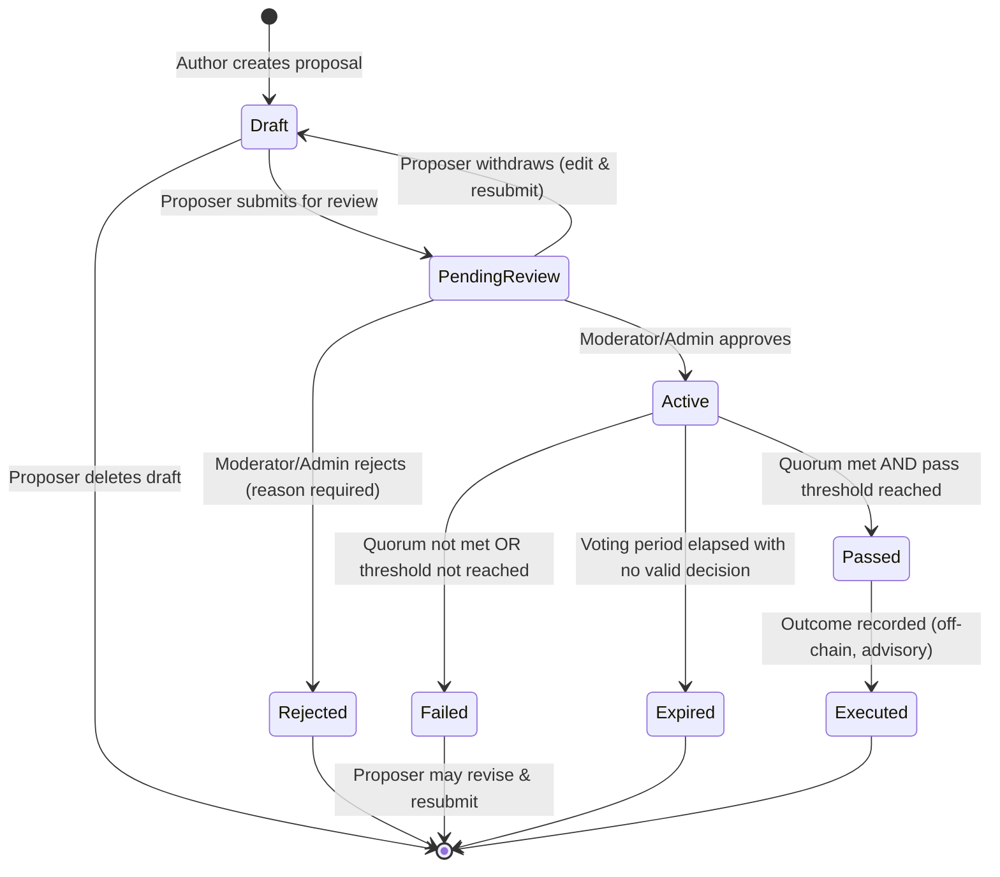

# OMNOM DAO — Governance Mechanics

> **TL;DR** — $OMNOM DAO governance is **snapshot-based, off-chain, and advisory**. Voting power is derived from a frozen on-chain balance snapshot taken at **Dogechain block 59,922,100 (June 7, 2026 23:59:58 UTC)** covering **25,431 holders**. There are **no live smart contracts**; verification uses gasless Sign-In with Ethereum (SIWE) message signing, and all balance/eligibility lookups resolve against a static, SHA-256-verified snapshot. The **v1 implementation baseline is 1 token = 1 vote (linear)**, with a PRD-recommended Quadratic Token Voting model deferred to v2. Proposals pass community-defined quorum and threshold gates; outcomes are **advisory decisions**, not auto-executed transactions. This document is the single authoritative reference for every governance mechanic and explicitly reconciles conflicting source-document recommendations.

---

## Table of Contents

1. [Governance Philosophy](#1-governance-philosophy)
2. [The Snapshot as Source of Truth](#2-the-snapshot-as-source-of-truth)
3. [Voting Power Calculation](#3-voting-power-calculation)
4. [Holder Classification & Eligibility](#4-holder-classification--eligibility)
5. [Proposal Types & Thresholds](#5-proposal-types--thresholds)
6. [Proposal Lifecycle](#6-proposal-lifecycle)
7. [Voting Rules](#7-voting-rules)
8. [Quorum & Pass Thresholds](#8-quorum--pass-thresholds)
9. [Delegation System](#9-delegation-system)
10. [Anti-Whale & Anti-Sybil Safeguards](#10-anti-whale--anti-sybil-safeguards)
11. [Moderation & Administration](#11-moderation--administration)
12. [Notifications](#12-notifications)
13. [Tokenomics Voting Framework](#13-tokenomics-voting-framework)
14. [Open Governance Decisions](#14-open-governance-decisions)
15. [Glossary](#15-glossary)
16. [Cross-References](#16-cross-references)

---

## 1. Governance Philosophy

The $OMNOM DAO operates on **off-chain, snapshot-based, advisory governance**. This model was chosen deliberately and is a consequence of the Dogechain sunset rather than a limitation to be worked around.

**Why this approach:**

- **Dogechain is dead.** On June 7, 2026 Dogechain (chain ID 2000) announced its sunset. The $OMNOM token contract (`0xe3fcA919883950c5cD468156392a6477Ff5d18de`, DRC-20, 18 decimals) is effectively frozen — holders still *own* their tokens, but there is no live chain to read state from or to execute transactions against.
- **No live smart contracts.** There is no on-chain governance contract to call. Governance therefore happens entirely off-chain, anchored to a cryptographic point-in-time snapshot that serves as a trustless record of who held what.
- **Gas-free and inclusive.** Verification uses Sign-In with Ethereum (SIWE) — read-only message signing with **no `eth_sendTransaction`, no token transfers, and no gas fees**. Every holder, from the largest 🐋 whale to a 🐟 fish with a handful of tokens, can participate at zero cost.
- **Advisory, not auto-executed.** A passed proposal is a **legitimate community decision**, recorded transparently, but it is not automatically executed by a contract. Execution (where applicable, e.g. a future migration) is a separate, human/community-coordinated step.

> ℹ️ **Read-only by design.** The platform NEVER requests a transaction, NEVER stores private keys, and NEVER transfers tokens. The only cryptographic action a holder performs is signing a human-readable message to prove wallet ownership.

---

## 2. The Snapshot as Source of Truth

The snapshot is the immutable anchor of legitimacy for all governance. It captures token balances exactly once and never changes.

| Field | Value |
|---|---|
| **Blockchain** | Dogechain (chain ID 2000) |
| **Token standard** | DRC-20 (18 decimals) |
| **Contract address** | `0xe3fcA919883950c5cD468156392a6477Ff5d18de` |
| **Snapshot block** | 59,922,100 |
| **Snapshot timestamp** | June 7, 2026 23:59:58 UTC |
| **Total holders captured** | 25,431 |
| **Burned by Vitalik** | 68.9% of total supply |
| **Circulating supply (post-burn)** | ~31.1% of total supply |

**Snapshot properties:**

- **Immutable.** No modifications after deployment. Any update requires a new platform deployment with an explicit changelog (see [`PRD.md`](../PRD.md) FR-2.6).
- **SHA-256 verified.** The original snapshot CSV is hash-verified on platform startup against a published SHA-256 checksum (stored in `public/data/snapshot-hash.txt`). The hash is displayed publicly so any holder can independently verify integrity. See [`DESIGN.md`](../DESIGN.md) §8.1 ("Snapshot tampering → SHA-256 hash verification").
- **No live chain queries.** All balance, rank, class, and eligibility data is read from static JSON derived from the snapshot at build time — never from a live RPC. This is what makes governance possible after the chain is gone.
- **Frozen voting power.** Balances are frozen as of the snapshot block. **No acquisition, transfer, or sale after June 7, 2026 23:59:58 UTC affects governance weight.** Your voice is fixed to what you held at that instant.

**Eligibility baseline:** any address holding **≥1 $OMNOM** in the snapshot is eligible to participate. Holders not present in the snapshot cannot vote, propose, or delegate — but they may browse proposals, results, and discussions as public observers.

---

## 3. Voting Power Calculation

Voting power is the weight applied to a holder's ballot. There is a **live implementation model (v1 linear)** and a **proposed future model (v2 quadratic)**. This section documents both and explicitly reconciles the conflict between source documents.

### 3.1 v1 Implementation Baseline — Linear (1 token = 1 vote) ✅ LIVE

The implemented v1 model, as specified in [`DESIGN.md`](../DESIGN.md) §1.2 and reflected in the [`DATA-MODEL.md`](../DATA-MODEL.md) schema, is **purely linear**:

```text
voting_power = raw_token_balance (from snapshot)
```

- One token equals one vote. Voting power is the holder's exact snapshot balance.
- Holder-class badges (🐋 / 🐬 / 🐟) are **cosmetic and social only** — they do not modify voting power. All classes vote proportionally to balance at a 1× modifier.
- The `voting_power` value is frozen at vote-cast time and stored alongside the ballot, so it can never drift even if the underlying data changed.
- In the votes table the power is recorded as `REAL` (see [`DATA-MODEL.md`](../DATA-MODEL.md) `votes.voting_power`).

```typescript
// DATA-MODEL.md — vote result calculation (v1, linear)
interface VoteResult {
  for: number;            // sum of voting_power of FOR ballots
  against: number;
  abstain: number;
  quorum: number;         // for + against + abstain
  quorumRequired: number; // total_supply × quorum_percentage
  passed: boolean;        // quorum met AND totalFor > totalAgainst
}
```

### 3.2 PRD-Recommended Future Model — Quadratic Token Voting (QTV) 🧪 PROPOSED (v2)

The PRD ([`PRD.md`](../PRD.md) §8 / FR-5) recommends a **Quadratic Token Voting** model to compress the whale-to-fish influence ratio. It is **aspirational and deferred to v2 / post-launch**, not implemented in v1.

```text
voting_power = floor(sqrt(raw_token_balance / 10^18)) × voting_multiplier

where:
  raw_token_balance = tokens held at snapshot (18 decimals, in wei)
  voting_multiplier = 1.0 (base), adjustable per proposal type by governance
```

**Rationale (per PRD):** pure 1-token-1-vote gives 4 whales ~77% of votes (mathematically democratic but practically oligarchic); pure one-person-one-vote gives 25,105 fish ~99.98% of votes (decoupled from economics). Quadratic voting preserves the *direction* of token-weighted influence while compressing the ratio from ~100,000:1 down to ~1,000:1, letting a coalition of dolphins meaningfully challenge a whale.

**Illustrative QTV distribution (from PRD §8):**

| Holder | Raw Balance | QTV Voting Power | Share of Total Power |
|---|---|---|---|
| 🐋 Whale #1 | ~5,000,000,000 | 70,710 | ~29% |
| 🐋 Whale #2 | ~2,000,000,000 | 44,721 | ~18% |
| 🐋 Whale #3 | ~1,500,000,000 | 38,729 | ~16% |
| 🐋 Whale #4 | ~500,000,000 | 22,360 | ~9% |
| 🐬 All Dolphins (322) | ~600,000,000 total | ~24,494 each | ~24% total |
| 🐟 All Fish (25,105) | ~400,000,000 total | ~126 each | ~8% total |

> ⚠️ **Source conflict — voting math.** [`DESIGN.md`](../DESIGN.md) §1.2 and [`DATA-MODEL.md`](../DATA-MODEL.md) specify **linear (1 token = 1 vote)** as the implementation baseline. [`PRD.md`](../PRD.md) §8/FR-5 recommends **quadratic** (`voting_power = floor(sqrt(raw_balance / 10^18)) × multiplier`).
>
> **v1 ships linear.** Quadratic is the PRD's recommended future enhancement, **deferred to v2 / post-launch**, pending the community decision recorded in [§14 Open Governance Decisions](#14-open-governance-decisions).

---

## 4. Holder Classification & Eligibility

Holders are classified by share of circulating supply (post-burn). Classes are used for proposal-creation gating and social signaling.

| Class | Threshold | Count | Emoji | Est. % of Circulating Supply |
|---|---|---|---|---|
| **Whale** | ≥ 1.00% of supply | 4 | 🐋 | ~77% |
| **Dolphin** | ≥ 0.01% and < 1.00% | 322 | 🐬 | ~15% |
| **Fish** | < 0.01% | 25,105 | 🐟 | ~8% |

> ℹ️ Class badges are **cosmetic** under v1 linear voting — they do not change voting power (see [§3.1](#31-v1-implementation-baseline--linear-1-token--1-vote--live)). They gate proposal creation (see [§5](#5-proposal-types--thresholds)).

### Eligibility matrix

| Action | Who may perform it |
|---|---|
| **Browse proposals / results / discussions** | Anyone (public, including non-holders) |
| **Vote** | Any verified holder with ≥1 $OMNOM in snapshot |
| **Comment** | Any verified holder (anti-spam rules apply — [§11](#11-moderation--administration)) |
| **Delegate / receive delegation** | Any verified holder |
| **Create high-impact proposals** (Chain, Tokenomics, Technical Spec) | Dolphin+ (≥0.01% supply) |
| **Create lower-impact proposals** (Treasury, Community, General) | Any verified holder |

---

## 5. Proposal Types & Thresholds

There are six proposal types. Each carries its own quorum, voting period, minimum creator holding, and pass threshold. The values below are the **PRD §9 recommendation**; v1 baseline per-type defaults are reconciled in [§8](#8-quorum--pass-thresholds).

| Type | Quorum | Voting Period (min) | Min Holding to Create | Pass Threshold |
|---|---|---|---|---|
| **Chain Selection** | 25% of supply | 7 days | 🐬 Dolphin+ (≥0.01%) | 60% supermajority |
| **Tokenomics Change** | 25% of supply | 7 days | 🐬 Dolphin+ | 60% supermajority |
| **Treasury / Resource** | 15% of supply | 72 hours | Any verified | Simple majority (>50%) |
| **Community Guideline** | 10% of supply | 72 hours | Any verified | Simple majority (>50%) |
| **Technical Spec** | 15% of supply | 72 hours | 🐬 Dolphin+ | 60% supermajority |
| **General Discussion** | 5% of supply | 72 hours | Any verified | Simple majority (>50%) |

> ℹ️ **Why tiered creation thresholds?** High-impact decisions (chain migration, tokenomics) should be proposed by stakeholders with meaningful economic exposure (Dolphin+), while resource, guideline, and sentiment proposals remain open to any verified holder. See [`PRD.md`](../PRD.md) §9 ("Who Can Create Proposals").

### Simple majority vs. supermajority

- **Simple majority** — a proposal passes when FOR voting power exceeds AGAINST voting power among non-abstaining ballots (`totalFor > totalAgainst`). Used for Treasury, Community, and General proposals.
- **Supermajority** — FOR voting power must reach **≥60%** of (FOR + AGAINST) voting power cast. Abstentions do not count toward the outcome denominator. Used for Chain, Tokenomics, and Technical Spec proposals.

> ℹ️ In the v1 result engine ([`DATA-MODEL.md`](../DATA-MODEL.md)), the base condition is `passed = quorumRequired met AND totalFor > totalAgainst`. The per-type supermajority gate (60%) is an additional threshold layered on top of this for the high-impact types and must be enforced by the proposal-type configuration.

---

## 6. Proposal Lifecycle

A proposal moves through a defined state machine. Each state restricts who can act and for how long.

### 6.1 States

| State | Description | Allowed Actions | Duration |
|---|---|---|---|
| **Draft** | Proposer is composing. Visible only to proposer. | Edit, delete, submit for review | Unlimited |
| **Pending Review** | Submitted, awaiting moderator approval. Visible as "Under Review." | Moderator: approve / reject (with reason). Proposer: edit, withdraw | Configurable — see callout |
| **Active** | Open for voting. Visible to all. | Vote, comment, delegate | Configurable duration (see below) |
| **Closed** | Voting period ended. Results final. | View results; read-only discussion continues | Permanent |
| **Passed** | Sub-state of Closed. Quorum met **and** threshold exceeded. | Execute (if applicable — advisory), archive | Permanent |
| **Failed** | Sub-state of Closed. Quorum not met **or** threshold not reached. | Archive; proposer may create revised proposal | Permanent |
| **Expired** | Sub-state of Closed. Active period elapsed without a valid decision. | Archive | Permanent |
| **Rejected** | Moderator/admin rejected during review. | Archive | Permanent |
| **Executed** | Outcome recorded (off-chain action taken). | Archive | Permanent |

### 6.2 Editing & transition rules

- **Editing:** the proposer may edit any field while the proposal is in **Draft** or **Pending Review**. All edits are logged with timestamps and a visible "Edited [timestamp]" badge plus revision history. No edits are permitted once a proposal is **Active**.
- **Approval / rejection:** moderators/admins approve or reject during Pending Review. Rejections must include a reason. On approval, the proposal transitions to **Active** and voting opens.
- **Auto-close:** a cron job checks for expired proposals and transitions Active → Closed → Passed/Failed/Expired when the voting window elapses ([`DESIGN.md`](../DESIGN.md) §4.5 Proposal Module).

> ⚠️ **Source conflict — Pending Review duration.** [`PRD.md`](../PRD.md) FR-6 specifies **max 7 days** in Pending Review (auto-reject if not reviewed). [`DESIGN.md`](../DESIGN.md) §4.3 specifies a **24-hour auto-approve** path.
>
> **v1 implementation baseline:** treat Pending Review duration as a **configurable parameter**. The deployed default should be chosen by the community; see [§14 Open Governance Decisions](#14-open-governance-decisions). Until decided, document the conflict and pick one default at deploy time.

### 6.3 Active voting duration (v1 UI options)

The v1 creation flow offers selectable durations per [`UI-WIREFRAMES.md`](../UI-WIREFRAMES.md) / [`DESIGN.md`](../DESIGN.md): **24h, 72h, 7d, 14d, 30d**. Per-type minimums from [§5](#5-proposal-types--thresholds) still apply (e.g. Chain Selection minimum is 7 days).

### 6.4 Lifecycle state diagram



> ℹ️ The diagram above is the canonical lifecycle. Note [`DATA-MODEL.md`](../DATA-MODEL.md) enumerates terminal statuses as `PASSED`, `FAILED`, `EXPIRED` (with `REJECTED` reachable during review) — consistent with this state machine.

---

## 7. Voting Rules

### 7.1 Vote choices

| Choice | Effect |
|---|---|
| **FOR** ✅ | Counts toward the outcome (supports the proposal) |
| **AGAINST** ❌ | Counts toward the outcome (opposes the proposal) |
| **ABSTAIN** ⬜ | Counts **toward quorum only** — does NOT count toward the pass/fail outcome |

### 7.2 Core rules

- **One vote per (proposal, address).** Enforced at the database layer by a `UNIQUE`/primary-key constraint on `(proposal_id, voter_address)` (see [`DATA-MODEL.md`](../DATA-MODEL.md) `votes` table, and [`DESIGN.md`](../DESIGN.md) §8.1 "Double voting → PRIMARY KEY constraint"). Attempting a second vote for the same proposal from the same address updates the existing ballot rather than inserting a duplicate.
- **Snapshot-weighted.** Each ballot's `voting_power` is the voter's frozen snapshot balance (v1 linear). Delegated power is added where applicable ([§9](#9-delegation-system)).
- **Vote changes allowed** until the **final 12 hours** of the voting period. During the last 12 hours, the "Change Vote" control is removed and the existing ballot is locked. Changing a vote requires a fresh signature.
- **Real-time counting.** Tallies are computed live from the database on read (no separate counter to avoid drift) and update within ~10 seconds via optimistic UI + polling/WebSocket ([`PRD.md`](../PRD.md) NFR-2).
- **Voting window.** Votes are only accepted while `vote_start ≤ now ≤ vote_end`. Ballots outside the Active window are rejected.

### 7.3 Quorum accounting

Quorum participation is measured as the **sum of FOR + AGAINST + ABSTAIN** voting power divided by total snapshot supply. Because ABSTAIN counts toward quorum but not toward the outcome, a proposal can reach quorum on abstentions alone yet still fail to pass (no FOR majority).

---

## 8. Quorum & Pass Thresholds

### 8.1 How quorum is calculated

```text
quorumAchieved % = (totalFor + totalAgainst + totalAbstain) / totalSnapshotSupply × 100

passed (base) = (quorumAchieved ≥ quorumRequired) AND (totalFor > totalAgainst)
```

For supermajority proposal types, add the additional gate:

```text
passed (supermajority) = passed (base) AND (totalFor / (totalFor + totalAgainst) ≥ 0.60)
```

> ⚠️ **Source conflict — default quorum & pass threshold.** Three sources disagree:
> - [`DATA-MODEL.md`](../DATA-MODEL.md) — default `quorum_required = 10.0` (schema default), with seeded per-type defaults ranging 10–15%.
> - [`DESIGN.md`](../DESIGN.md) / [`PRD.md`](../PRD.md) creation UI — quorum floor of **5%** (min 5%, max 50%), implying a 5–10% practical default.
> - [`PRD.md`](../PRD.md) §8/FR-5 — recommends **global quorum 20% of total supply** and **60% supermajority** to pass.
> - [`TOKENOMICS-OPTIONS.md`](../TOKENOMICS-OPTIONS.md) — suggests **5% minimum quorum** as a floor for community consideration.
>
> **v1 implementation baseline:** default quorum **5–10%** (per-type, per [`DATA-MODEL.md`](../DATA-MODEL.md) seeded defaults 10–15%). The PRD's higher **20% quorum + 60% supermajority** is a **governance parameter the community must decide on** — not silently adopted. This is logged in [§14 Open Governance Decisions](#14-open-governance-decisions).

### 8.2 Per-type thresholds (PRD §9 recommendation)

| Type | Quorum | Voting Period (min) | Pass Threshold |
|---|---|---|---|
| Chain Selection | 25% | 7 days | 60% supermajority |
| Tokenomics Change | 25% | 7 days | 60% supermajority |
| Treasury / Resource | 15% | 72 hours | Simple majority |
| Community Guideline | 10% | 72 hours | Simple majority |
| Technical Spec | 15% | 72 hours | 60% supermajority |
| General Discussion | 5% | 72 hours | Simple majority |

### 8.3 v1 seeded defaults (DATA-MODEL.md)

The deployed seed defaults differ slightly from the PRD recommendation and represent the current implementation baseline:

| Type | Default Quorum | Default Duration |
|---|---|---|
| Chain Selection | 15.0% | 336h (14d) |
| Treasury / Resource | 10.0% | 168h (7d) |
| Tokenomics Change | 15.0% | 336h (14d) |
| Technical Spec | 10.0% | 168h (7d) |
| Community Guideline | 10.0% | 168h (7d) |
| General Discussion | 10.0% | 168h (7d) |

> ⚠️ **Conflict — PRD §9 vs. seeded defaults.** The PRD recommends higher quorums (up to 25%) for Chain/Tokenomics, while the seeded `proposal_templates` defaults sit at 10–15%. **Treat the seeded values as the deploy-time default** and let the community vote to raise thresholds per [§14](#14-open-governance-decisions). A proposer may also override the default quorum at creation time (within the 5–50% floor).

---

## 9. Delegation System

Delegation lets a holder transfer their voting power to a trusted representative. The v1 delegation model is intentionally constrained.

| Rule | v1 Behavior |
|---|---|
| **Scope** | Any verified holder may delegate **100%** of their voting power to another verified holder |
| **Partial delegation** | **NOT supported in v1** (you cannot delegate e.g. 50%); complexity deferred |
| **Per-proposal override** | A delegator may **override** their delegation and vote directly on any specific proposal; the direct vote takes precedence for that proposal only |
| **New delegation delay** | A newly set delegation takes effect after a **24-hour time-lock** (prevents last-minute delegation swaps to swing a vote) |
| **Revocation** | **Instant** — revoking a delegation has no time-lock |
| **Max incoming delegations** | **500** per address (prevents single points of failure and delegation spam) |
| **Transparency** | All delegations are **publicly visible and logged**; whale-to-whale delegation is surfaced |

> ℹ️ **Quadratic interaction (v2 only).** Under the proposed QTV model, **delegated tokens are NOT square-rooted** — they transfer raw voting power directly. This prevents the square-root compression from being gamed by splitting balances across delegated wallets. This does not apply to v1 linear voting, where delegation simply transfers balance-weighted power.

---

## 10. Anti-Whale & Anti-Sybil Safeguards

The supply distribution is heavily skewed (4 whales ≈ 77% of circulating supply). Multiple safeguards prevent plutocratic capture and Sybil manipulation.

### 10.1 Anti-whale measures (PRD recommendations)

| Safeguard | Mechanism |
|---|---|
| **Quorum floor** | High-impact proposals require 15–25% of total supply to participate — whales alone can meet it, but it ensures broad economic backing |
| **Supermajority threshold** | 60% of cast power must be FOR on high-impact types — blocks narrow 51% whale coalitions from forcing wins |
| **Public delegation tracking** | All delegations visible; whale-to-whale concentration is surfaced |
| **24h delegation time-lock** | New delegations delayed 24h — prevents last-minute vote-swinging |
| **30% unique-holder veto** | If **30% of unique holders (by count, not tokens)** vote AGAINST, a **7-day cooling-off period** is triggered before the proposal can be re-submitted |

> ℹ️ The 30% veto / cooling-off period is a **PRD recommendation** to be ratified by the community; it is not yet enforced in the v1 result engine.

### 10.2 Anti-Sybil

- **Snapshot is the Sybil defense.** Because governance is anchored to a fixed snapshot of on-chain balances, no new "fake" addresses can be created to inflate voting power after the fact. The snapshot is treated as immutable truth ([`DESIGN.md`](../DESIGN.md) §8.1).
- **No new balances.** Post-snapshot acquisitions, transfers, or freshly generated wallets carry zero governance weight.

### 10.3 Rate limits & anti-spam

| Rule | Value | Purpose |
|---|---|---|
| Min time between proposals | **24 hours** | Prevent proposal flooding |
| Max proposals per 7-day window | **3** per holder | Limit bulk spam |
| Min time between comments | **30 seconds** | Prevent comment spam |
| Max comment length | **2,000 characters** | Prevent noise |
| Duplicate proposal detection | **Fuzzy title match (Levenshtein ≤ 3)** within 7 days | Prevent near-duplicate proposals |

*(Source: [`DESIGN.md`](../DESIGN.md) §8.4 Anti-Spam Measures.)*

---

## 11. Moderation & Administration

### 11.1 Roles

| Role | Capabilities |
|---|---|
| **Admin** | Full platform control — assign/remove moderators, approve/reject proposals, update platform settings, publish announcements, override proposal status (emergency), view analytics |
| **Moderator** | Approve/reject proposals during review, hide/remove spam or abusive comments, flag abuse |
| **Holder (verified)** | Vote, comment, delegate, create proposals (tier-gated per [§5](#5-proposal-types--thresholds)) |
| **Visitor (unverified)** | Browse proposals, results, and discussions read-only |

### 11.2 Permissions matrix

| Action | Admin | Moderator | Holder | Visitor |
|---|:---:|:---:|:---:|:---:|
| View proposals / results | ✅ | ✅ | ✅ | ✅ |
| Vote | ✅ | ✅ | ✅ | ❌ |
| Comment | ✅ | ✅ | ✅ | ❌ |
| Create proposal | ✅ | ✅ | ✅ (tier-gated) | ❌ |
| Approve / reject proposals | ✅ | ✅ | ❌ | ❌ |
| Hide / remove comments | ✅ | ✅ | ❌ | ❌ |
| Assign moderators | ✅ | ❌ | ❌ | ❌ |
| Platform settings | ✅ | ❌ | ❌ | ❌ |
| Status override (emergency) | ✅ | ❌ | ❌ | ❌ |
| View audit log | ✅ | ✅ | ✅ | ✅ |

### 11.3 Admin configuration & audit

- **Admin addresses** are stored in the environment variable `NEXT_PUBLIC_ADMIN_ADDRESSES` (comma-separated). Admin endpoints verify the JWT-signed address against this list ([`DESIGN.md`](../DESIGN.md) §4.5 Admin Module, §8.1).
- **Public audit log.** All moderator and admin actions are logged with timestamp, actor, action, and target. The log is **publicly viewable** by all users ([`PRD.md`](../PRD.md) FR-10.5, [`DESIGN.md`](../DESIGN.md) NFR-1).
- **Appeals.** Moderated actions can be appealed by the affected user; appeals are reviewed by admins (FR-10.4).
- **Initial moderators** are TBD by community consensus (likely: original deployer, active Telegram admins, recognized contributors).

### 11.4 Rate limits (API / platform)

| Limit | Value |
|---|---|
| API rate per IP | 100 req/min |
| API rate per authenticated user | 20 req/min |
| `/api/verify` | 10 req/min |
| `/api/vote` | 30 req/min |

*(Source: [`PRD.md`](../PRD.md) NFR-1, [`DESIGN.md`](../DESIGN.md) §8.1.)*

---

## 12. Notifications

Notifications keep holders engaged across the proposal lifecycle. Holders configure which types route to which channel.

### 12.1 Channels

| Channel | Mechanism | Status |
|---|---|---|
| **Telegram** | `@DBOT_DC_BOT` — user runs `/start`, receives a unique code, links it on the platform | v1 ✅ |
| **Email** | Resend API — confirm-opt-in with verification email | v1.1 (optional) |
| **In-app** | Bell icon in nav with unread-count badge and dropdown | v1 ✅ |

### 12.2 Notification types

| Type | Trigger |
|---|---|
| **Proposal created** | A new proposal is submitted |
| **Voting started** | A proposal transitions to Active |
| **Ending soon** | An active proposal has **<24 hours** remaining |
| **Quorum at risk** | An active proposal has <24h left and has not reached quorum |
| **Result** | A proposal transitions to Closed / Passed / Failed / Expired |
| **Delegation received / revoked** | A new incoming delegation is confirmed or revoked |
| **Mention / comment on my proposal** | Another holder comments on a proposal you authored |

*(Sources: [`PRD.md`](../PRD.md) FR-8, [`DESIGN.md`](../DESIGN.md) §4.5 Notification Module.)*

---

## 13. Tokenomics Voting Framework

Once the DAO selects a migration path, the most consequential decisions are tokenomics. [`TOKENOMICS-OPTIONS.md`](../TOKENOMICS-OPTIONS.md) defines a **6-round sequential voting framework** so the community decides one variable at a time, each building on the prior outcome.

### 13.1 The 6 rounds

| Round | Decision | Threshold |
|---|---|---|
| **Round 1** | **Chain Selection** — which blockchain to migrate/relaunch onto | Simple majority |
| **Round 2** | **Migration Model** — Pure 1:1 (Option A) vs. Treasury allocation (Option C) vs. Abstain | Supermajority (>60%) |
| **Round 3** | **Burn Rate** — transaction burn percentage (e.g. 0.5% / 1.0% / 2.0%) | Simple majority |
| **Round 4** | **Treasury Size + Yield Source** — treasury allocation % (5–15%) and staking yield origin | Treasury: supermajority; Yield source: simple majority |
| **Round 5** | **Liquidity Strategy** — DEX LP approach and seeding | Simple majority |
| **Round 6** | **Implementation Audit** — ongoing review of executed decisions | Ongoing |

> ℹ️ Rounds are **sequential and conditional** — later rounds only run if earlier rounds produce an actionable outcome (e.g. Round 4 treasury questions only apply if Round 2 approved a treasury model).

### 13.2 The 5 tokenomics model options

A brief summary of the post-migration tokenomics models under consideration (full detail in [`TOKENOMICS-OPTIONS.md`](../TOKENOMICS-OPTIONS.md)):

| Option | Model | Core Idea |
|---|---|---|
| **A** | **Pure Migration** | 1:1 airdrop of $OMNOM to the new chain. Simplest, no mechanics changes. |
| **B** | **Deflationary Burn** | 1:1 airdrop + a transaction burn (0.5%–2.0%) sent to a verifiable dead address. Reduces supply over time. |
| **C** | **Staking & Treasury** | Treasury allocation (5–15%) taken as an equal-percentage haircut; holders stake for voting power + yield. |
| **D** | **Liquidity Pool / DEX** | DAO seeds a DEX LP ($OMNOM + paired token) to enable price discovery and trading. |
| **E** | **Hybrid** *(recommended starting point)* | Combines A + B + C + D in a phased rollout — 1:1 migration → burn → treasury/staking → DEX liquidity. |

### 13.3 Decision thresholds guidance

| Decision | Recommended Threshold | Rationale |
|---|---|---|
| Chain selection | Simple majority | Reversible, lowest friction |
| Treasury allocation | Supermajority (>60%) | Affects everyone's holdings |
| Burn rate | Simple majority (>50%) | Adjustable if wrong |
| Constitution / charter | 2/3 majority (>67%) | Foundational, hard to change |

---

## 14. Open Governance Decisions

The following parameters are **unresolved** and require community ratification before they are finalized. Until decided, the **v1 implementation baseline** values apply. Each item links back to the section where the conflict is documented.

| # | Decision | Options | v1 Baseline | Section |
|---|---|---|---|---|
| 1 | **Voting math model** | Linear (1 token = 1 vote) vs. Quadratic Token Voting | Linear | [§3](#3-voting-power-calculation) |
| 2 | **Global default quorum** | 5% (TOKENOMICS) / 5–10% (DESIGN/DATA-MODEL) / 20% (PRD) | 5–10% per-type | [§8](#8-quorum--pass-thresholds) |
| 3 | **Global pass threshold** | Simple majority vs. 60% supermajority for all types | Per-type (simple or 60% per §5) | [§8](#8-quorum--pass-thresholds) |
| 4 | **Pending Review duration** | 24h auto-approve (DESIGN) vs. max 7 days (PRD) | Configurable — pick at deploy | [§6.2](#62-editing--transition-rules) |
| 5 | **Per-type quorums** | PRD §9 (up to 25%) vs. seeded defaults (10–15%) | Seeded DATA-MODEL defaults | [§8.3](#83-v1-seeded-defaults-data-modelmd) |
| 6 | **Min holding to create proposals** | Dolphin+ for high-impact / any verified for low-impact (current proposal) vs. any-verified with priority review | Dolphin+ for Chain/Tokenomics/Tech; any for others | [§5](#5-proposal-types--thresholds) |
| 7 | **30% unique-holder veto / cooling-off** | Adopt PRD recommendation or defer | Not enforced in v1 | [§10.1](#101-anti-whale-measures-prd-recommendations) |
| 8 | **Snapshot dispute resolution** | Trust snapshot + Blockscout link / formal dispute process / community override | Trust snapshot (no dispute in v1) | [`PRD.md`](../PRD.md) Q4 |
| 9 | **Multi-wallet aggregation** | Max wallets per user; abuse prevention | Aggregation allowed, each wallet signed independently | [`PRD.md`](../PRD.md) Q5 |
| 10 | **Emergency proposals** | Add an "emergency" type (24h voting, 35% quorum, multi-whale/moderator trigger) | None in v1 | [`PRD.md`](../PRD.md) Q10 |
| 11 | **Whale vote transparency** | Force whale votes public / opt-out with notification / full privacy toggle | Public-by-default with privacy toggle | [`PRD.md`](../PRD.md) Q8 |
| 12 | **Governance vs. snapshot token** | If migration introduces a new token, does governance switch? | Snapshot-based only (v1) | [`PRD.md`](../PRD.md) Q9 |

> ⚠️ **These are binding governance decisions, not engineering choices.** Each must be put to a community vote (likely via General Discussion proposals to start) before being hardcoded into the platform defaults.

---

## 15. Glossary

| Term | Definition |
|---|---|
| **Advisory governance** | A governance model where passed proposals are legitimate community decisions recorded transparently, but are **not auto-executed** by a smart contract. Execution is a separate coordinated step. |
| **Snapshot** | A frozen, point-in-time record of token holdings at a specific block (here, Dogechain block 59,922,100). The sole source of truth for balances and eligibility in off-chain governance. |
| **SIWE** | **Sign-In with Ethereum** — an authentication pattern (EIP-4361) where a user signs a human-readable message with their wallet to prove ownership, with **no transaction and no gas**. |
| **Quorum** | The minimum participation threshold (as a % of total supply) required for a vote's result to be valid/binding. If quorum is not met, the proposal fails as "Quorum Not Met." |
| **Supermajority** | A pass threshold higher than 50%. In $OMNOM DAO, high-impact proposals require ≥60% of cast (non-abstaining) voting power to be FOR. |
| **Simple majority** | A pass threshold where FOR voting power merely needs to exceed AGAINST voting power (>50%). |
| **Voting power** | The weight applied to a holder's ballot. v1 = raw snapshot balance (linear); proposed v2 = `floor(sqrt(balance / 10^18)) × multiplier` (quadratic). |
| **Delegation** | Transferring your voting power to another verified holder who votes on your behalf. v1 supports 100% delegation with per-proposal override. |
| **Cooling-off period** | A mandatory delay (7 days) triggered when 30% of unique holders vote AGAINST, before the proposal can be re-submitted. A PRD-recommended safeguard. |
| **Time-lock** | A delay before a governance action takes effect — e.g. new delegations are delayed 24h to prevent last-minute vote manipulation. |
| **DRC-20** | Dogechain's token standard, analogous to Ethereum's ERC-20. $OMNOM is a DRC-20 token with 18 decimals. |
| **Quadratic voting (QTV)** | A voting system where voting power scales with the square root of tokens held, compressing the whale-to-fish influence ratio. Proposed for $OMNOM v2. |
| **Levenshtein distance** | A measure of edit distance between two strings. Used in $OMNOM's anti-spam (titles within Levenshtein ≤ 3 of a recent proposal are flagged as duplicates). |

---

## 16. Cross-References

| Document | Relevance |
|---|---|
| [`PROJECT_OVERVIEW.md`](PROJECT_OVERVIEW.md) | High-level project context, scope, and the post-sunset narrative |
| [`TECHNICAL_ARCHITECTURE.md`](TECHNICAL_ARCHITECTURE.md) *(see also [`DESIGN.md`](../DESIGN.md))* | System architecture, data flow, SIWE verification, snapshot lookup optimization |
| [`CONTRIBUTOR_ONBOARDING.md`](CONTRIBUTOR_ONBOARDING.md) | Developer setup, environment variables, and contribution workflow |
| [`../PRD.md`](../PRD.md) | Product requirements — voting mechanism design (§8), proposal types (§9), open questions (§12) |
| [`../TOKENOMICS-OPTIONS.md`](../TOKENOMICS-OPTIONS.md) | The 5 tokenomics models and the 6-round sequential voting framework |

---

*This is the definitive governance reference for the $OMNOM DAO. All governance parameters marked as conflicts or open decisions must be ratified by community vote before being adopted as platform defaults. Update this document's changelog on every governance parameter change.*
