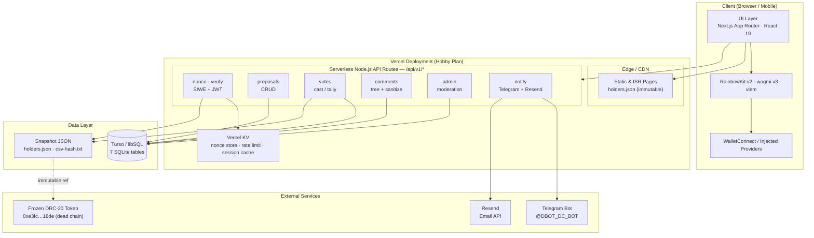
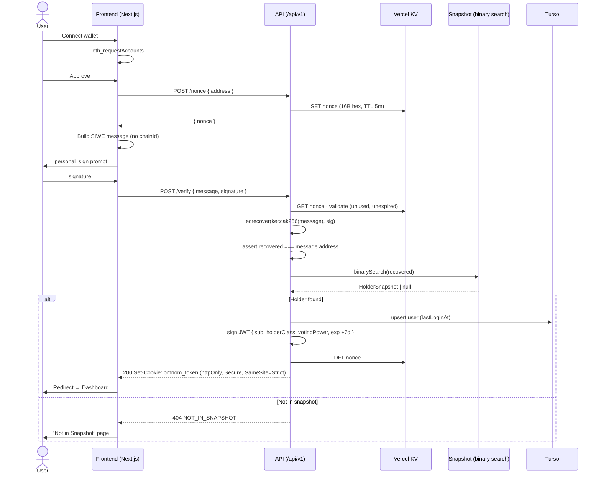
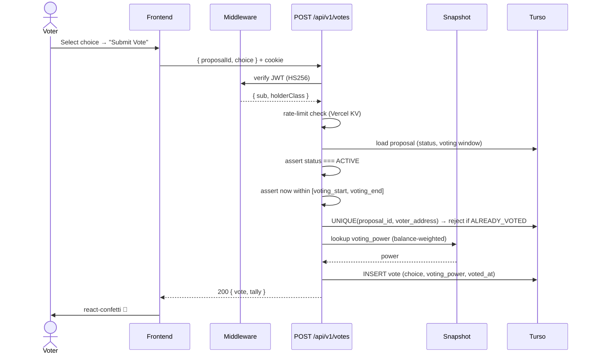
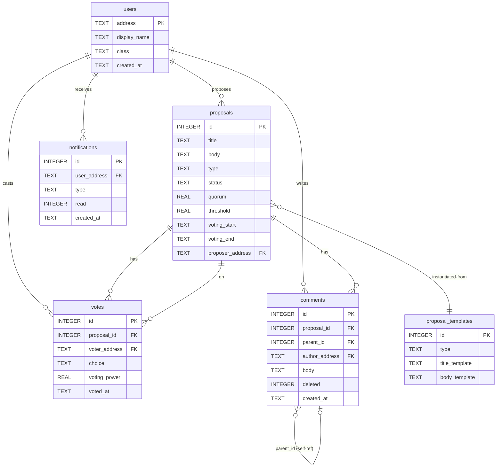
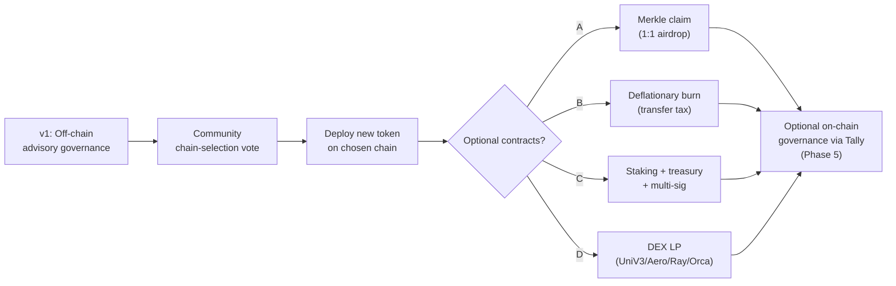

# OMNOM DAO — Technical Architecture & Smart Contract Interactions

| Field | Value |
|---|---|
| **Document** | Technical Architecture & Smart Contract Interactions |
| **Version** | Draft v1.0.0 |
| **Date** | June 2026 |
| **Status** | Draft — Under Review |
| **Author** | DBOT / OMNOM DAO Core Team |
| **License** | MIT (Open Source) |
| **Related Docs** | [PROJECT_OVERVIEW.md](PROJECT_OVERVIEW.md), [GOVERNANCE_MECHANICS.md](GOVERNANCE_MECHANICS.md), [../DESIGN.md](../DESIGN.md), [../WALLET-FLOW.md](../WALLET-FLOW.md), [../DATA-MODEL.md](../DATA-MODEL.md), [../TOKENOMICS-OPTIONS.md](../TOKENOMICS-OPTIONS.md) |

---

## TL;DR

OMNOM DAO v1 is a **Next.js 15 (App Router) monolith** that performs **fully off-chain, advisory governance** against a **frozen token-holding snapshot** (block 59,922,100, captured 2026-06-07). Because Dogechain (chain ID 2000) is sunset, **there are no live smart contracts and no on-chain interactions** — identity is proven via **SIWE (EIP-4361)** off-chain message signing, verified server-side with `ecrecover`, then cross-referenced against the immutable snapshot via **O(log n) binary search**. State (proposals, votes, comments, sessions) lives in **Turso (libSQL/SQLite)**; session cache and rate limiting use **Vercel KV**; the app is deployed on **Vercel (Hobby Plan)** as static/ISR pages plus serverless Node.js API routes. The only contract referenced in v1 is the frozen DRC-20 token `0xe3fcA919883950c5cD468156392a6477Ff5d18de`. All future contracts (claim, burn, staking, DEX LP, on-chain voting via Tally) are **post-migration hypotheticals**, contingent on a community chain-selection vote and explicitly **not part of v1**.

---

## Table of Contents

1. [Architecture Overview](#1-architecture-overview)
2. [System Components](#2-system-components)
3. [Technology Stack](#3-technology-stack)
4. [Data Flow Architecture](#4-data-flow-architecture)
5. [Database Schema & Data Model](#5-database-schema--data-model)
6. [Authentication & Session Management](#6-authentication--session-management)
7. [API Reference Summary](#7-api-reference-summary)
8. [Snapshot System](#8-snapshot-system)
9. [Caching Strategy](#9-caching-strategy)
10. [Security Architecture](#10-security-architecture)
11. [Performance & Scalability Targets](#11-performance--scalability-targets)
12. [Smart Contract Architecture](#12-smart-contract-architecture)
13. [Environment Configuration](#13-environment-configuration)
14. [Deployment Architecture](#14-deployment-architecture)
15. [Monitoring & Observability](#15-monitoring--observability)
16. [Open Technical Questions](#16-open-technical-questions)
17. [Cross-References](#17-cross-references)

---

## 1. Architecture Overview

### 1.1 Approach: Next.js App Router Monolith

OMNOM DAO v1 is built as a **single Next.js 15 application** using the **App Router** paradigm. The app serves two distinct runtime surfaces from one codebase:

- **Edge/CDN layer** — statically generated and ISR pages (home, proposal list, closed proposals) plus immutable static assets (snapshot JSON, hash files).
- **Serverless Node.js functions** — sensitive operations only: SIWE signature recovery, JWT issuance, vote/proposal writes, nonce generation, admin moderation, notifications.

Only the operations that **must** run server-side (signature recovery via `viem`'s `ecrecover`, vote writing, JWT minting) execute in API routes. Everything else is either statically rendered or hydrated client-side. This keeps the serverless surface minimal, cold-start cheap, and within the Vercel Hobby Plan free-tier envelope.

### 1.2 Why a Monolith (Rejected Alternatives)

| Option | Verdict | Rationale |
|---|---|---|
| **Pure SPA + third-party API** | ❌ Rejected | No backend to perform trusted `ecrecover`, nonce store, or JWT issuance. Snapshot and vote integrity could not be guaranteed client-side. |
| **Separate backend server** | ❌ Rejected | Adds infra cost, deployment complexity, CORS/CSP surface, and a second process to scale — incompatible with the free-tier constraint. |
| **Next.js App Router monolith** | ✅ Chosen | One deploy unit, shared types, edge static + serverless on the same domain (no CORS), Vercel free-tier friendly, type-safe end-to-end. |

The core data flow is:

> **User → wallet sign → API verifies signature (`ecrecover` via viem) → API looks up address in snapshot → returns holder data → UI renders → JWT in httpOnly cookie.**

### 1.3 System Architecture Diagram



> ℹ️ The dashed edge from the snapshot to the frozen token contract is **reference-only**. No runtime RPC call is ever made — the chain is dead.

---

## 2. System Components

### 2.1 Presentation Layer

| Concern | Technology |
|---|---|
| Framework | Next.js 15 (App Router) |
| UI runtime | React 19 |
| Language | TypeScript (strict mode) |
| Styling | Tailwind CSS v4 |
| Component system | shadcn/ui |
| Animation | framer-motion v11 |
| Markdown | react-markdown v9 + remark-gfm v4 |
| Icons | lucide-react |
| Notifications | react-hot-toast |
| Celebration FX | react-confetti |

Pages follow a **mobile-first**, responsive design. Markdown bodies (proposals, comments) are sanitized with **DOMPurify** before render to neutralize XSS.

### 2.2 Wallet Integration Layer

Wallet connection uses **RainbowKit v2** over **wagmi v3** and **viem**. Because Dogechain is dead, the app declares a **custom read-only "Dogechain (Snapshot)" chain config** (chain ID `2000`) that exists only for wallet UI context — no RPC URL is configured and **no on-chain reads are issued**. SIWE signing uses `personal_sign`, which is purely a local elliptic-curve operation.

- Connection bootstrap: `eth_requestAccounts`
- Signing: `personal_sign` (human-readable SIWE message)
- No `balanceOf()`, no EIP-712 domain, no meta-transactions, no gas.

### 2.3 Authentication Layer

See [§6 Authentication & Session Management](#6-authentication--session-management). In short: SIWE message → server `ecrecover` → snapshot lookup → JWT (`HS256` via `jose`) → `httpOnly` + `Secure` + `SameSite=Strict` cookie `omnom_token`.

### 2.4 API Layer

All sensitive routes live under `/api/v1/*` as Next.js Route Handlers running in the **Node.js serverless runtime**. Every response conforms to a single `ApiResponse<T>` envelope (see [§7](#7-api-reference-summary)). Routes are intentionally thin: validate → authorize (JWT) → enforce rate limit (Vercel KV) → mutate Turso / lookup snapshot → return.

### 2.5 Data Layer

Primary mutable store is **Turso** (libSQL/SQLite, edge-deployable). Seven tables model users, proposals, votes, comments, notifications, proposal templates, plus session/nonce bookkeeping (see [§5](#5-database-schema--data-model)). All queries use **parameterized statements** (no string interpolation) to prevent SQL injection.

### 2.6 Static Data Layer

The token-holding snapshot is stored as **immutable static JSON** under `/public/data/` (`holders.json`, `snapshot-map.json`, `snapshot-hash.txt`). It is treated as a build artifact: generated once from the canonical CSV, integrity-sealed with SHA-256, and **never mutated at runtime**. Lookup is an in-memory binary search over a sorted address index (O(log n)).

### 2.7 Infrastructure

| Component | Role |
|---|---|
| Vercel (Hobby) | Hosting, edge CDN, serverless functions, KV |
| Turso | Edge SQLite database (read replicas near users) |
| Vercel KV | Nonce store (5-min TTL), rate-limit counters, session cache |
| Telegram Bot `@DBOT_DC_BOT` | Community notifications / alerts |
| Resend | Transactional email (optional) |

---

## 3. Technology Stack

| Package | Version | Purpose |
|---|---|---|
| `next` | ^15 | App Router framework, serverless API routes, ISR/SSG/SSR |
| `react` / `react-dom` | ^19 | UI runtime |
| `@rainbow-me/rainbowkit` | ^2.1 | Wallet connection UI + provider |
| `wagmi` | ^3 | React hooks for wallet state |
| `viem` | ^2.15 | `ecrecover`, `keccak256`, ECDSA verification, SIWE parsing |
| `@tanstack/react-query` | ^5.50 | Server-state caching / data fetching |
| `jose` | ^5.2 | JWT sign/verify (HS256) |
| `@libsql/client` | ^0.6 | Turso (libSQL) driver |
| `@vercel/kv` | ^2 | Nonce store, rate limiting, session cache |
| `resend` | ^3 | Transactional email (optional) |
| `react-markdown` | ^9 | Render proposal/comment bodies |
| `remark-gfm` | ^4 | GitHub-flavored markdown support |
| `framer-motion` | ^11 | Transitions / micro-interactions |
| `react-confetti` | ^6.1 | Vote-cast celebration |
| `react-hot-toast` | ^2.4 | Toast notifications |
| `lucide-react` | ^0.400 | Icon set |
| `dompurify` | ^3.1 | HTML sanitization (XSS defense) |
| `papaparse` | ^5.4 | Snapshot CSV parsing (build pipeline) |
| TypeScript | strict | Type safety end-to-end |

---

## 4. Data Flow Architecture

### 4.1 Authentication Flow (SIWE / EIP-4361)

> ⚠️ **JWT expiry source conflict:** The PRD specified a 24-hour session. The implemented truth in [../DESIGN.md](../DESIGN.md) and [../WALLET-FLOW.md](../WALLET-FLOW.md) is a **7-day JWT** (`Max-Age 604800`). This document treats **7 days as canonical**.

The 7-step flow:

1. **Wallet connection** — UI calls `eth_requestAccounts` via the selected provider (MetaMask, WalletConnect, Coinbase, etc.).
2. **Nonce fetch** — `POST /api/v1/nonce { address }` → server mints a 16-byte hex nonce, stores it in Vercel KV with a **5-minute TTL**.
3. **SIWE message built client-side** — includes `domain`, `address`, `nonce`, `issuedAt`. **Chain ID is intentionally omitted** (dead chain, chain-agnostic).
4. **User signs** via `personal_sign`.
5. **Verification** — `POST /api/v1/verify { message, signature }`:
   - validate nonce (exists, unused, not expired),
   - `ecrecover(keccak256(message), signature)` → `recoveredAddress`,
   - assert `recoveredAddress === message.address`,
   - **binary-search** the snapshot for `recoveredAddress`.
6. **JWT issued** in `httpOnly` cookie `omnom_token`, `Max-Age 604800` (7 days).
7. **Middleware** validates the JWT on subsequent requests; refresh occurs within a 90-day absolute maximum.



### 4.2 Voting Flow



Key invariants enforced server-side: JWT validity, rate limit, proposal active & in-window, no double-vote (`UNIQUE(proposal_id, voter_address)`), voting power derived from the immutable snapshot.

### 4.3 Proposal Creation Flow

1. JWT verified by middleware.
2. Rate-limit check (Vercel KV) — anti-spam.
3. Validate payload against the selected `ProposalType` template (one of 6 seeded in `proposal_templates`).
4. Insert into `proposals` with `status = DRAFT` or `PENDING`, `voting_start`/`voting_end` set per type defaults, `proposer_address = sub`.
5. Optionally fire notification (Telegram/Resend) to the community/admins.
6. Return the created proposal in the `ApiResponse<Proposal>` envelope.

### 4.4 Snapshot Lookup Flow

```mermaid
flowchart LR
    A[recoveredAddress] --> B[Load snapshot-map.json once<br/>into in-memory sorted Map]
    B --> C{binary search<br/>O(log n)}
    C -->|hit| D[HolderSnapshot<br/>rank, balance, class]
    C -->|miss| E[null → NOT_IN_SNAPSHOT]
```

- **n = 25,431** holders → ~15 comparisons worst-case.
- On-disk JSON lookup: **~0.01 ms**; with in-memory `Map` after first load: **<10 ms** end-to-end including parse.
- Addresses are stored **checksummed** and sorted lexicographically to guarantee deterministic binary-search behavior.

---

## 5. Database Schema & Data Model

OMNOM DAO v1 uses **7 Turso/SQLite tables**. All DDL lives in [../DATA-MODEL.md](../DATA-MODEL.md); the canonical entity interfaces are reproduced there as TypeScript. The ER diagram and column-level reference follow.

### 5.1 ER Diagram



### 5.2 Table Reference

| Table | Purpose | PK | Notable Constraints |
|---|---|---|---|
| [`users`](../DATA-MODEL.md) | Verified holders created lazily on first auth | `address` (EVM, checksummed) | `class` ∈ {KRAKEN, WHALE, DOLPHIN, SHARK, OCTOPUS, CRAB, SEAHORSE, FISH@deprecated}; `created_at` set once |
| [`proposals`](../DATA-MODEL.md) | Governance proposals | `id` | `type` ∈ 6 ProposalTypes; `status` lifecycle; `quorum`/`threshold` per type |
| [`votes`](../DATA-MODEL.md) | Cast votes | `id` | **`UNIQUE(proposal_id, voter_address)`** — hard anti-double-vote |
| [`comments`](../DATA-MODEL.md) | Threaded discussion | `id` | **self-referential `parent_id`**; **soft-delete** via `deleted` flag |
| [`notifications`](../DATA-MODEL.md) | In-app alerts | `id` | `type` enum; `read` boolean |
| `proposal_templates` | 6 seed templates (one per ProposalType) | `id` | Seed data only; not user-mutable |
| `sessions` (bookkeeping) | Tracks JWT issuance / nonce usage | `id` | Backed by Vercel KV for nonce TTL |

### 5.3 Key Constraints & Patterns

- **Anti-double-vote** — `UNIQUE(proposal_id, voter_address)` is the database-level guarantee; the API additionally checks status and window. This is the single source of truth — even a race between two concurrent requests will be rejected by the unique constraint.
- **Self-referential comments** — `comments.parent_id → comments.id` enables arbitrarily deep reply trees. Root-level comments have `parent_id IS NULL`.
- **Soft-delete** — Comments are never hard-deleted; a `deleted` flag keeps audit trails intact and preserves reply integrity. Deleted comments render as `[deleted]`.
- **Snapshot immutability** — The snapshot is **not** a table; it is a static JSON artifact. Voting power is read at vote-cast time and **written into the `votes` row**, so historical tallies are stable even if (hypothetically) the snapshot file were ever regenerated.

---

## 6. Authentication & Session Management

### 6.1 Why SIWE (EIP-4361)

Dogechain is dead — no RPC, no `balanceOf()`, no meta-transactions, no EIP-712 domain, no live chain ID. We need to prove "this user controls address X" **without any blockchain interaction**. SIWE solves this:

- **Chain-agnostic** — the ECDSA signature is valid regardless of chain liveness.
- **Gas-free** — `personal_sign` is a local wallet operation.
- **Standard** — supported by MetaMask, WalletConnect, Coinbase Wallet, and all major providers.
- **Human-readable** — users review exactly what they sign.
- **Replay-resistant** — nonce + `issuedAt` + 5-min TTL.

Rejected alternatives: on-chain `balanceOf()` (no RPC), meta-transactions (no relayer/chain), email/password (can't prove ownership), social login (no link to on-chain identity), ENS reverse resolution (ENS is on mainnet, not Dogechain).

### 6.2 Session Lifecycle

| Stage | Mechanism | Detail |
|---|---|---|
| Identity proof | SIWE `personal_sign` | See [§4.1](#41-authentication-flow-siwe--eip-4361) |
| Server verify | `ecrecover(keccak256(msg), sig)` via viem | Assert recovered === claimed |
| Holder lookup | binary-search snapshot | `HolderSnapshot` or `NOT_IN_SNAPSHOT` |
| Token | JWT **HS256** via `jose` | claims: `sub`, `holderClass`, `votingPower`, `iat`, `exp` |
| Cookie | `omnom_token` | `httpOnly`, `Secure`, `SameSite=Strict`, `Max-Age=604800` (7d) |
| Nonce TTL | Vercel KV | 16-byte hex, **5-minute** expiry, single-use |
| Refresh | sliding, within 90-day absolute max | Beyond 90d, re-auth required |
| Validation | Next.js middleware | every protected route |

> ⚠️ **JWT expiry conflict (source of truth):** PRD said **24h**; [../DESIGN.md](../DESIGN.md) and [../WALLET-FLOW.md](../WALLET-FLOW.md) specify **7 days (604800s)**. The **7-day value is canonical** for v1. If you are editing session code, treat 7 days as the spec.

### 6.3 Cookie Security Rationale

- **`httpOnly`** — JavaScript cannot read the token → defeats XSS-based session theft.
- **`Secure`** — token only transmitted over HTTPS.
- **`SameSite=Strict`** — blocks cross-site request inclusion → primary CSRF defense (no separate CSRF token needed).
- **No `localStorage` token** — the JWT never touches client JS; all authed requests rely on the cookie.

---

## 7. API Reference Summary

### 7.1 Response Envelope

Every endpoint returns `ApiResponse<T>`:

```typescript
interface ApiResponse<T> {
  success: boolean;
  data?: T;
  error?: { code: ApiErrorCode; message: string; details?: unknown[] };
  meta?: { page?: number; pageSize?: number; total?: number; cursor?: string };
}
```

### 7.2 Error Codes

| Code | Meaning | Typical HTTP |
|---|---|---|
| `UNAUTHORIZED` | Missing/invalid JWT | 401 |
| `INVALID_SIGNATURE` | `ecrecover` mismatch | 401 |
| `NONCE_EXPIRED` | Nonce missing or >5min old | 401 |
| `PROPOSAL_NOT_FOUND` | No such proposal id | 404 |
| `NOT_IN_SNAPSHOT` | Address absent from snapshot | 403/404 |
| `NOT_VERIFIED` | Wallet not verified | 403 |
| `VOTING_CLOSED` | Proposal not in active window | 409 |
| `ALREADY_VOTED` | `UNIQUE(proposal_id, voter_address)` violated | 409 |
| `RATE_LIMITED` | Vercel KV counter exceeded | 429 |

### 7.3 Endpoints

| Method | Path | Purpose | Auth | Response `data` |
|---|---|---|---|---|
| `POST` | `/api/v1/nonce` | Issue 16-byte hex nonce (5m TTL) | none | `{ nonce }` |
| `POST` | `/api/v1/verify` | SIWE verify → JWT cookie | none | `User` |
| `GET` | `/api/v1/proposals` | List proposals (paginated) | none/public | `Proposal[]` + meta |
| `GET` | `/api/v1/proposals/:id` | Proposal detail + live tally | none/public | `Proposal` |
| `POST` | `/api/v1/proposals` | Create proposal (template-bound) | JWT | `Proposal` |
| `POST` | `/api/v1/votes` | Cast vote | JWT | `Vote` |
| `GET` | `/api/v1/proposals/:id/votes` | Tally / vote feed | none/public | `VoteTally` |
| `GET/POST` | `/api/v1/comments` | Comment tree (threaded) | mixed | `Comment[]` |
| `POST` | `/api/v1/comments/:id` | Soft-delete / edit | JWT (owner/admin) | `Comment` |
| `GET` | `/api/v1/notifications` | User notifications | JWT | `Notification[]` |
| `POST` | `/api/v1/admin/*` | Moderation (close proposal, ban) | JWT + admin | varies |

Rate limits are enforced via Vercel KV counters per route + per address/IP bucket.

---

## 8. Snapshot System

The snapshot is the **immutable foundation of all governance power**, captured at block 59,922,100 on 2026-06-07 23:59:58 UTC. It is a build-time artifact, **never mutated at runtime**.

### 8.1 Build Pipeline

```
CSV (canonical) ──┐
                  ├─► parse/validate (papaparse)
                  │     • valid EVM addresses (checksum)
                  │     • no duplicates
                  │     • 25,431 holders total
                  ├─► sort by address (lexicographic)
                  ├─► build binary-search index
                  └─► emit artifacts:
                        • holders.json     (~3.5 MB raw / ~800 KB gzip)
                        • snapshot-map.json
                        • csv-hash.txt     (SHA-256)
```

### 8.2 Runtime Lookup

- **Algorithm:** binary search over the sorted address index → **O(log n)**, ~15 comparisons for n = 25,431.
- **Performance:** on-disk ~**0.01 ms** per lookup; with the array loaded into an in-memory `Map`, **<10 ms** end-to-end (incl. parse + checksum).
- Worst-case target: **<500 ms** cold; **<10 ms** warm.

### 8.3 Validation Checklist (build-time)

- ✅ Total holders (ever-held) = **25,686**
- ✅ Krakens (≥10%) = **1**
- ✅ Whales (≥1%) = **3**
- ✅ Dolphins (≥0.1%) = **30**
- ✅ Sharks (≥0.01%) = **326**
- ✅ Octopuses (≥0.001%) = **1,078**
- ✅ Crabs (≥0.0001%) = **1,701**
- ✅ Seahorses (<0.0001%) = **22,547**
- ✅ Every address is a valid EVM address (checksummed)
- ✅ No duplicate addresses
- ✅ `csv-hash.txt` (SHA-256) = `1f64a663549ca717c6b612dc71a5cf673ab58badee58f876474c0fc6e551c128`

### 8.4 Immutability & Integrity

- The snapshot file is **never written** by application code; it ships as a static asset under [`/public/data/`](../DESIGN.md).
- `csv-hash.txt` is the integrity seal: any tampering with `holders.json` is detectable by recomputing SHA-256 over the canonical CSV.
- **Voting power is snapshotted into each `votes` row at cast time**, so historical results remain stable and auditable even if a snapshot file were ever regenerated (it should not be).
- **Deploy-env note:** after the 7-tier classification change, `holders.json` must be regenerated (`npm run fetch:snapshot`) and `SNAPSHOT_SHA256` updated to the new artifact hash, even though the CSV hash (`1f64a663…`) is unchanged (byte-identical data). The environment variable pins the `holders.json` hash for integrity verification — a mismatch causes governance to fail closed. Deploy the new snapshot artifact and matching `SNAPSHOT_SHA256` together in the same release.

### 8.5 Holder Classification (cosmetic only)

| Class | Threshold | Count | Voting Power |
|---|---|---|---|
| 🦑 Kraken | ≥ 10% supply | 1 | 1× balance-weighted |
| 🐋 Whale | ≥ 1% and < 10% | 3 | 1× balance-weighted |
| 🐬 Dolphin | ≥ 0.1% and < 1% | 30 | 1× balance-weighted |
| 🦈 Shark | ≥ 0.01% and < 0.1% | 326 | 1× balance-weighted |
| 🐙 Octopus | ≥ 0.001% and < 0.01% | 1,078 | 1× balance-weighted |
| 🦀 Crab | ≥ 0.0001% and < 0.001% | 1,701 | 1× balance-weighted |
| 🦄 Seahorse | < 0.0001% | 22,547 | 1× balance-weighted |
| **Total** | — | **25,686** | — |

> ℹ️ Class badges are **cosmetic/social** — voting power is strictly balance-weighted (1 token = 1 vote) in v1. Quadratic voting is an open v2 question ([§16](#16-open-technical-questions)).

---

## 9. Caching Strategy

| Page / Surface | Strategy | TTL / Notes |
|---|---|---|
| Home / proposal list | **ISR** | revalidate `60s` |
| Active proposal detail | **ISR** | revalidate `30s` (tally freshness) |
| Closed proposals | **SSG** | static at build, immutable |
| Dashboard | **SSR** | personalized per user (JWT) |
| Settings | **CSR** | client-only, no SSR |
| Snapshot JSON | **static immutable** | CDN-cached, never invalidated |
| API writes (votes/comments) | no cache | always hit Turso |
| Nonce store | Vercel KV | 5-min TTL, single-use |
| Rate-limit counters | Vercel KV | sliding window per bucket |

ISR `revalidate` values are tuned so that a vote submitted via the SSR/CSR path propagates to public tallies within the **real-time update target of <10 s** ([§11](#11-performance--scalability-targets)).

---

## 10. Security Architecture

### 10.1 Threat Model

| # | Threat | Mitigation |
|---|---|---|
| 1 | Signature replay | Per-address nonce, **5-min TTL**, single-use; `issuedAt` in SIWE message |
| 2 | Session hijacking | `httpOnly` + `Secure` + `SameSite=Strict` cookie; no token in JS |
| 3 | JWT forgery | `HS256` via `jose`, `JWT_SECRET ≥ 32 chars`; server-side signing only |
| 4 | Double voting | DB constraint `UNIQUE(proposal_id, voter_address)` — hard guarantee |
| 5 | Sybil / fake holders | Snapshot-only eligibility; address must exist in frozen snapshot |
| 6 | XSS | DOMPurify sanitization of markdown/HTML; strict CSP |
| 7 | CSRF | `SameSite=Strict` cookie (no cross-site inclusion) |
| 8 | Rate-limit / spam | Vercel KV counters per route + address + IP; fuzzy duplicate detection |
| 9 | SQL injection | 100% parameterized Turso queries; no string interpolation |
| 10 | Snapshot tampering | SHA-256 `csv-hash.txt` integrity seal; immutable static asset |
| 11 | Admin impersonation | `NEXT_PUBLIC_ADMIN_ADDRESSES` allow-list checked server-side against JWT `sub` |

### 10.2 Anti-Spam Measures

- **Rate limiting** — sliding-window counters in Vercel KV per route, per wallet address, and per IP. Writes (votes, comments, proposals) get tighter buckets than reads.
- **Fuzzy duplicate detection** — comments/proposals are checked for near-duplicate content to block spam floods (e.g., normalized-text similarity within a time window).
- **Snapshot gating** — only verified snapshot holders may write, eliminating throwaway-wallet spam.

---

## 11. Performance & Scalability Targets

| Metric | Target |
|---|---|
| Page load on 3G | **< 3 s** |
| API p95 latency | **< 200 ms** |
| Snapshot lookup (cold) | **< 500 ms** |
| Snapshot lookup (warm, in-memory) | **< 10 ms** |
| Concurrent viewers | **25,000** |
| Real-time tally propagation | **< 10 s** |

### Scaling on Vercel Hobby (free tier)

- **Static/ISR pages** serve from the edge CDN — effectively unbounded read concurrency for public pages.
- **Serverless functions** scale horizontally per request; the write-heavy surface (votes) is small and burst-bounded by rate limits, so function concurrency stays within free-tier quotas during active proposals.
- **Turso** provides edge read replicas close to users; writes are single-region with async replication.
- **Vercel KV** is a managed Redis-compatible store — nonce/rate-limit reads are sub-millisecond.
- **Risk:** a viral active-proposal window could spike function invocations; mitigation is aggressive ISR caching of tallies and write-side rate limiting.

---

## 12. Smart Contract Architecture

### 12.1 v1 Has No Governance Smart Contracts — Read This First

> ⚠️ **Critical:** OMNOM DAO **v1 has no governance smart contracts.** Governance is **entirely off-chain and advisory**. No on-chain vote, no on-chain execution, no timelock, no treasury contract. The only contract referenced anywhere in v1 is the **frozen original DRC-20 token** on the dead Dogechain chain, and even that is **never called at runtime** — it exists only as the source of the snapshot.

Everything in v1 — identity (SIWE), voting power (snapshot), vote recording (Turso), and results (advisory tally) — happens **off-chain**. This is an intentional consequence of the Dogechain sunset.

### 12.2 The Single Frozen Token (v1 reference only)

| Field | Value |
|---|---|
| Name | $OMNOM (DRC-20) |
| Standard | DRC-20 (Dogechain ERC-20 equivalent) |
| Chain | Dogechain (ID `2000`) — **SUNSET, not live** |
| Contract address | `0xe3fcA919883950c5cD468156392a6477Ff5d18de` |
| Decimals | 18 |
| Snapshot block | 59,922,100 (2026-06-07 23:59:58 UTC) |
| Total holders | 25,431 |
| Vitalik burn | 68.9% of supply |

This contract is **frozen and unreadable** — the snapshot was the final read. No `balanceOf()`, no `transfer()`, no events are queryable. The address appears in `SnapshotMetadata.contractAddress` purely for provenance/audit.

### 12.3 Migration Path (off-chain → on-chain)



The transition is **conditional** on a community vote selecting a target chain. None of the contracts below exist or are scheduled for v1.

### 12.4 Future / Hypothetical Contracts (post-migration, **not v1**)

All four options are mutually compatible building blocks, each contingent on the chain-selection vote. They are **specification-level only** — no Solidity exists.

| Option | Contract | Purpose | Interaction Model | Trigger |
|---|---|---|---|---|
| **A** | Merkle-tree claim | 1:1 airdrop of the new token to snapshot holders | Users submit Merkle proof; contract verifies against committed root and credits tokens (one-time claim). | After chain selection + new token deploy |
| **B** | Deflationary burn | Transfer-tax modifier that burns a % per transfer | ERC-20 with `_update` override routing tax to `0x0` or burn sink; reduces supply over time. | Optional tokenomics decision |
| **C** | Staking + Treasury + Multi-sig | Long-term DAO treasury management | Staking contract locks tokens for voting weight; treasury holds funds; multi-sig (e.g., Gnosis Safe) executes governance outputs. | Mature-DAO phase |
| **D** | DEX liquidity pool | Establish market price / exit liquidity | Deploy pool on **Uniswap V3** (EVM) or **Aerodrome** (Base) or **Raydium / Orca** (Solana) depending on chosen chain. | Post-token-deploy |

> ⚠️ **Do not implement any of Options A–D in v1.** They are contingent on (a) a successful community chain-selection vote and (b) new token deployment. The snapshot in v1 is the only source of truth for holdings; any future claim would derive its Merkle root from this same snapshot.

### 12.5 On-Chain Governance Roadmap (Tally — Phase 5)

Per [../ROADMAP.md](../ROADMAP.md) Phase 5, the long-term vision is **optional on-chain voting via [Tally](https://www.tally.xyz)**. Tally integrates with governor-style contracts (e.g., OpenZeppelin `Governor`) to provide proposal creation, vote recording, quorum/threshold, and execution on-chain. This is explicitly **Phase 5**, far post-migration, and replaces — not supplements — the v1 advisory model only after the community has migrated to a live chain with a working token.

---

## 13. Environment Configuration

| Variable | Required | Description | Example | Vercel Setting |
|---|---|---|---|---|
| `NEXT_PUBLIC_WC_PROJECT_ID` | ✅ | WalletConnect Cloud project id (client-visible) | `a1b2c3…` | Project → Settings → Environment Variables (all envs, **Public**) |
| `JWT_SECRET` | ✅ | HS256 signing secret, **≥ 32 chars** | (random 64-char string) | Environment Variables (Production + Preview, **Encrypted**) |
| `TURSO_DATABASE_URL` | ✅ | libSQL connection URL | `libsql://omnom-…turso.io` | Environment Variables (all envs, Encrypted) |
| `TURSO_AUTH_TOKEN` | ✅ | Turso access token | `eyJhbGci…` | Environment Variables (all envs, Encrypted) |
| `NEXT_PUBLIC_ADMIN_ADDRESSES` | ⬜ | Comma-separated admin addresses | `0xabc…,0xdef…` | Environment Variables (Public) |
| `NEXT_PUBLIC_TELEGRAM_BOT_TOKEN` | ⬜ | Bot token for `@DBOT_DC_BOT` | `123456:ABC-…` | Environment Variables (Encrypted) |
| `RESEND_API_KEY` | ⬜ | Resend email API key | `re_…` | Environment Variables (Encrypted) |
| `NEXT_PUBLIC_SITE_URL` | ⬜ | Canonical site URL (SIWE domain, emails) | `https://omnomdao.xyz` | Environment Variables (Public) |

> ℹ️ `NEXT_PUBLIC_*` vars are bundled into the client; everything sensitive (`JWT_SECRET`, `TURSO_AUTH_TOKEN`, `RESEND_API_KEY`, `NEXT_PUBLIC_TELEGRAM_BOT_TOKEN`) must **not** be prefixed `NEXT_PUBLIC_` and must be server-only.

---

## 14. Deployment Architecture

### 14.1 Model

- **Platform:** Vercel, Hobby Plan (free tier).
- **Build:** `next build` → static export for immutable pages, serverless bundles for `/api/v1/*` (Node.js runtime), edge output for ISR/SSG pages.
- **Regions:** Serverless functions run in a primary region; Turso read replicas and Vercel KV are placed close to it to minimize write latency. Static/ISR served globally from the edge CDN.
- **Zero-downtime:** Each Vercel deploy is atomic — a new deployment goes live only after build success; the previous deployment keeps serving until the swap. Instant rollback is available via the Vercel dashboard / CLI.
- **Uptime target:** **99.9% during active voting windows** — public read paths are CDN-served (high availability); the only single point of failure for writes is Turso + the serverless function region, both of which are managed services with their own SLAs.

### 14.2 Managed-Service Dependencies

| Service | Role | Failure Impact |
|---|---|---|
| Vercel Edge CDN | Public pages + static snapshot | Read-only browsing survives most outages |
| Vercel Serverless (Node) | All API writes | Vote/comment/proposal submission fails |
| Turso | Proposals/votes/comments | All writes fail; reads of dynamic data fail |
| Vercel KV | Nonce + rate limit | New logins and rate-limited writes fail |
| Telegram / Resend | Notifications | Non-critical; degrades gracefully |

---

## 15. Monitoring & Observability

| Signal | Source | Action |
|---|---|---|
| Web Vitals / page perf | Vercel Analytics + Speed Insights | Track against **<3 s on 3G** budget |
| API latency / p95 | Vercel function logs + custom metrics | Alert if p95 > **200 ms** |
| Function errors | Vercel runtime logs | Triage 5xx spikes, especially during active votes |
| DB health | Turso metrics (queries, latency, replication lag) | Watch for write-region saturation |
| Auth failures | Spike in `INVALID_SIGNATURE` / `NONCE_EXPIRED` | Possible replay/abuse signal |
| Rate-limit hits | Vercel KV counter logs | Tune buckets; flag abuse |
| Snapshot integrity | Recompute SHA-256 vs `csv-hash.txt` on deploy | Fail build on mismatch |

### Performance Budgets

- Client bundle: keep lean; lazy-load heavy deps (`react-confetti`, `framer-motion`) behind route/code splitting.
- Snapshot JSON: serve **gzipped** (~800 KB), CDN-cached, immutable.
- API: p95 **<200 ms**; snapshot warm lookup **<10 ms**.

---

## 16. Open Technical Questions

These remain **unresolved** and are tracked for future iterations:

| # | Question | Notes |
|---|---|---|
| 1 | **Quadratic voting** — adopt in v2? | Currently 1 token = 1 vote. Quadratic would reduce whale dominance; needs a credit/subsidy model and on/off-chain cost math. |
| 2 | **Real-time strategy** — polling vs SSE vs WebSocket | v1 relies on ISR (30–60 s) + client refetch. True push (SSE/WS) would meet stricter real-time targets but costs a persistent connection on serverless. |
| 3 | **Multi-chain support timeline** | v1 is Dogechain-snapshot-only. Post-migration, RainbowKit/wagmi chain config must support the new live chain. |
| 4 | **JWT expiry reconciliation** | PRD (24h) vs DESIGN/WALLET-FLOW (7d). Canonical = 7d; PRD should be updated. |
| 5 | **Comment moderation policy** | Soft-delete exists; automated spam/abuse thresholds + admin tooling need definition. |
| 6 | **Tally integration prerequisites** | Requires a live governor contract + token; entirely Phase 5, blocked on chain-selection vote. |
| 7 | **Snapshot regeneration policy** | Should the snapshot ever be re-cut (e.g., to exclude proven burn addresses)? Currently immutable; any change breaks historical vote integrity unless power is snapshotted into rows (it is). |
| 8 | **DEX selection (Option D)** | UniV3 / Aerodrome / Raydium / Orca — chain-dependent; deferred to tokenomics decision ([../TOKENOMICS-OPTIONS.md](../TOKENOMICS-OPTIONS.md)). |

---

## 17. Cross-References

| Document | Path | Relevance |
|---|---|---|
| Project Overview | [PROJECT_OVERVIEW.md](PROJECT_OVERVIEW.md) | High-level product context |
| Governance Mechanics | [GOVERNANCE_MECHANICS.md](GOVERNANCE_MECHANICS.md) | Proposal types, quorum/threshold rules |
| Contributor Onboarding | `CONTRIBUTOR_ONBOARDING.md` | Dev setup, contribution flow |
| Design Document | [../DESIGN.md](../DESIGN.md) | Canonical architecture & UX design source |
| Wallet Flow | [../WALLET-FLOW.md](../WALLET-FLOW.md) | SIWE detail, message format, `ecrecover` |
| Data Model | [../DATA-MODEL.md](../DATA-MODEL.md) | Full TypeScript interfaces + SQLite DDL |
| Tokenomics Options | [../TOKENOMICS-OPTIONS.md](../TOKENOMICS-OPTIONS.md) | Burn/claim/staking (Options A–D) detail |
| PRD | [../PRD.md](../PRD.md) | Product requirements (note: 24h JWT conflict) |
| Roadmap | [../ROADMAP.md](../ROADMAP.md) | Phased plan incl. Tally (Phase 5) |

---

*Document end — Draft v1.0.0. This is the definitive technical reference for OMNOM DAO v1 architecture and smart contract interactions. Update the version and changelog on any substantive change.*
