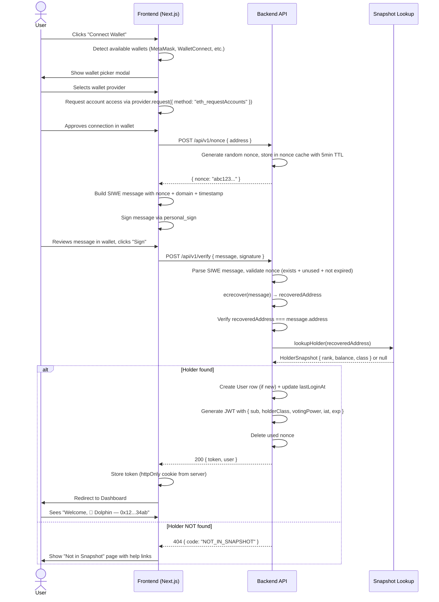
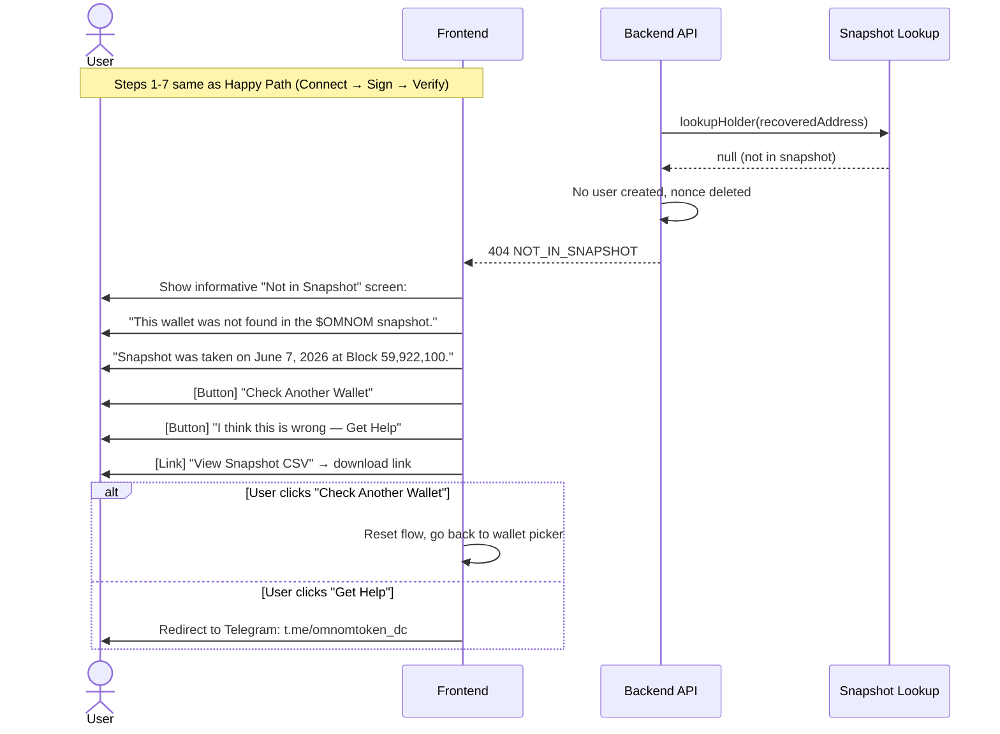
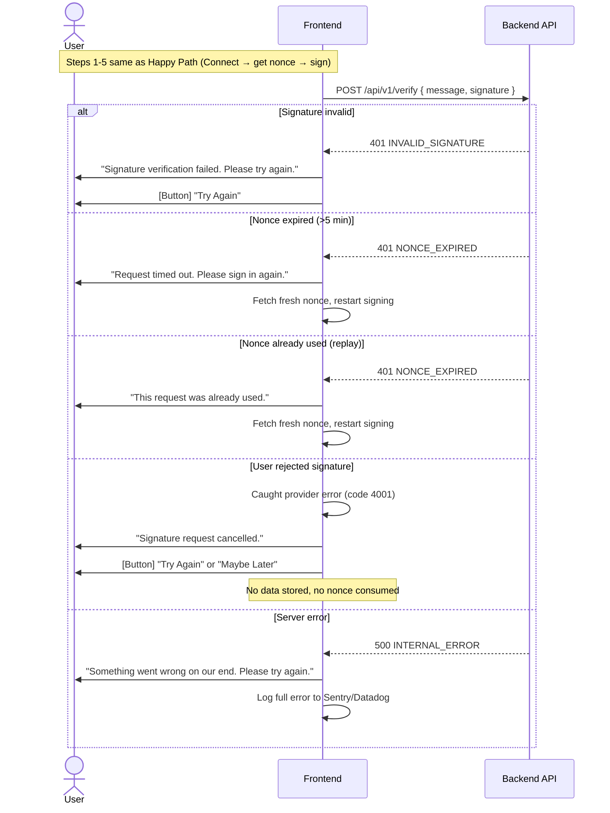
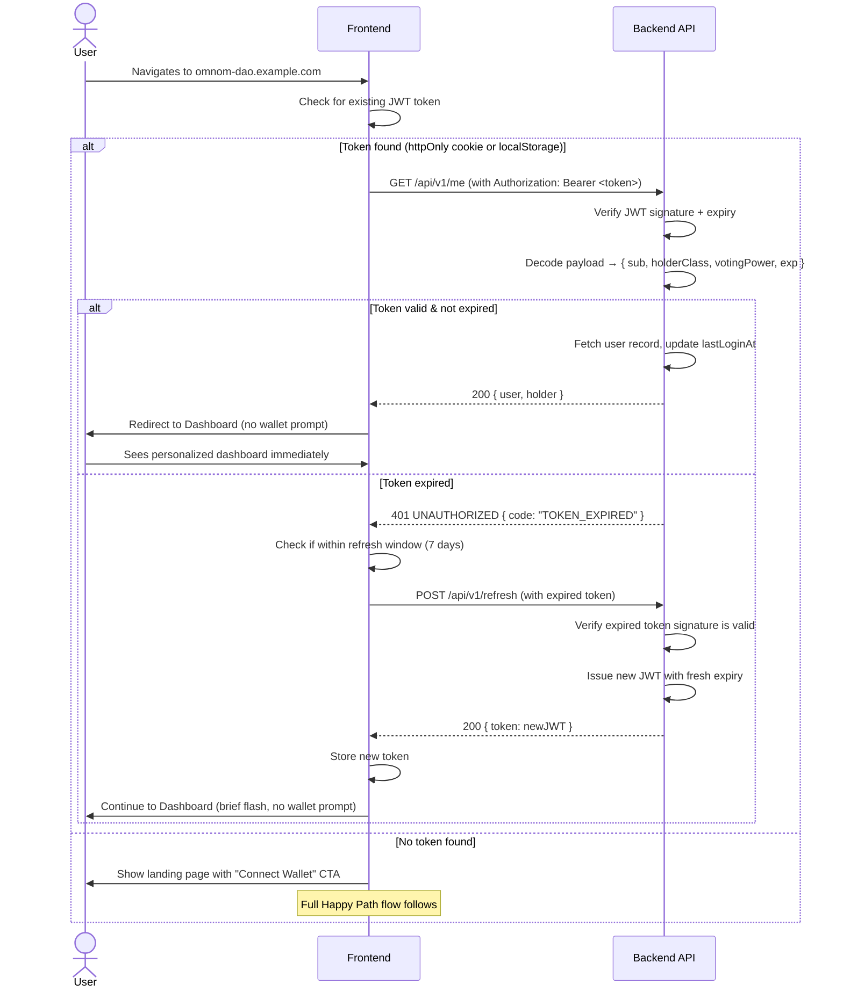

# $OMNOM DAO Governance Platform — Wallet Flow Reference

---

## Document Metadata

- **Document Title:** $OMNOM DAO — Wallet Connection & Verification Flow
- **Version:** 1.0.0
- **Author:** DBOT / OMNOM DAO Core Team
- **Date:** 2026-06-23
- **Status:** Draft — Under Review
- **Related Docs:** PRD.md, DESIGN.md, DATA-MODEL.md

---

## Table of Contents

1. [Overview: Why SIWE?](#1-overview-why-siwe)
2. [Flow Diagrams (Mermaid)](#2-flow-diagrams-mermaid)
3. [Step-by-Step Detailed Flow](#3-step-by-step-detailed-flow)
4. [SIWE Message Format](#4-siwe-message-format)
5. [Signature Verification (ecrecover)](#5-signature-verification-ecrecover)
6. [Session Management (JWT)](#6-session-management-jwt)
7. [Edge Cases](#7-edge-cases)
8. [Security Checklist](#8-security-checklist)

---

## 1. Overview: Why SIWE?

### The Problem

Dogechain is **sunset** as of June 7, 2026. There is no live RPC node. No blocks are being produced. No transactions can be submitted, confirmed, or queried. This eliminates:

- **On-chain verification** — cannot call `balanceOf()` on the contract
- **Meta-transactions** — no relayer network exists to submit on behalf of users
- **EIP-712 typed data signing with chain-specific domain** — chain ID 2000 is dead

We need a way to prove "this user controls address X" **without any blockchain interaction**.

### The Solution: SIWE (Sign-In with Ethereum)

SIWE is an Ethereum Foundation standard (EIP-4361) for authenticating users by having them sign a human-readable message with their wallet's private key. The signature proves wallet ownership because only the private key holder can produce a valid signature for their address.

**Why SIWE works here:**

- Chain-agnostic — the signature is an elliptic curve operation that works regardless of which chain the user is connected to
- Gas-free — signing is a local wallet operation, no on-chain transaction
- Standard — widely supported by MetaMask, WalletConnect, Coinbase Wallet, and all major providers
- Human-readable — users see what they're signing (not an opaque hex hash)
- Secure — nonce + timestamp prevent replay and stale-request attacks

**Why NOT alternatives:**

| Alternative | Why Not |
|---|---|
| On-chain `balanceOf()` | Dogechain is dead — no RPC |
| Meta-transactions | No relayer, no chain to submit to |
| Email/password auth | Can't prove wallet ownership |
| Social login (Google/Twitter) | Can't link to on-chain identity |
| ENS reverse resolution | ENS is on Ethereum mainnet, not Dogechain |

---

## 2. Flow Diagrams (Mermaid)

### 2.1 Happy Path — First Visit



### 2.2 Not Found Path



### 2.3 Error Path



### 2.4 Return Visit — Existing Session



---

## 3. Step-by-Step Detailed Flow

### Step 1: Wallet Connection

**Frontend:**
- On page load, detect `window.ethereum` (MetaMask) and other injected providers
- If WalletConnect is configured, show QR code option
- Present a modal listing detected wallets + "WalletConnect" fallback
- On selection, call `provider.request({ method: "eth_requestAccounts" })`
- Store connected provider reference in React context

**Backend:** Nothing yet.

**Data passed:** None (purely client-side).

**Error handling:**
- No wallet detected → show "Install MetaMask" / "Use WalletConnect" message
- User rejects connection → dismiss modal, show nothing stored, no error toast needed
- Multiple accounts → use `accounts[0]` (first connected account), allow switching later

**Timing:** ~1-3 seconds (includes user interaction).

---

### Step 2: Fetch Nonce

**Frontend:**
- After wallet connects, extract `address` from `accounts[0]`
- Send `POST /api/v1/nonce` with `{ address }`

**Backend:**
- Generate a cryptographically random nonce: `crypto.randomBytes(16).toString('hex')` → 32-char hex string
- Store nonce in an in-memory cache (or Redis) keyed by address, with a 5-minute TTL
- If a nonce already exists for this address, invalidate the old one (overwrite)
- Return `{ nonce }` to the frontend

**Data passed:**
```
Request:  POST /api/v1/nonce
Body:     { "address": "0x12...34ab" }
Response: { "nonce": "a1b2c3d4e5f6a7b8c9d0e1f2a3b4c5d6" }
```

**Error handling:**
- Invalid address format → 400 `INVALID_ADDRESS`
- Rate limited → 429 `RATE_LIMITED`
- Server error → 500, frontend retries once after 2s

**Timing:** ~100-500ms (network round-trip).

---

### Step 3: Build SIWE Message

**Frontend:**
- Construct the SIWE message string per the template in [Section 4](#4-siwe-message-format)
- Fields are populated: domain (from `window.location.hostname`), address, nonce, timestamp (current UTC ISO 8601)

**Backend:** Nothing.

**Data passed:** None (message built locally on frontend).

**Timing:** Instant (< 1ms).

---

### Step 4: User Signs Message

**Frontend:**
- Call `provider.request({ method: "personal_sign", params: [message, address] })`
- The wallet shows the human-readable SIWE message to the user
- User taps "Sign" (or "Reject")

**Backend:** Nothing.

**Data passed:** The `personal_sign` call passes the UTF-8 encoded message and the signer address.

**Error handling:**
- User rejects → catch error code 4001, abort flow gracefully, no nonce consumed
- Wallet times out (hardware wallets) → catch timeout error, show "Still waiting for your wallet..." with cancel option
- Wrong account selected → signature will fail verification later (recovered address won't match claimed address)

**Timing:**
- Software wallet (MetaMask): ~1-3 seconds
- Hardware wallet (Ledger/Trezor): ~5-15 seconds
- Mobile wallet (WalletConnect): ~3-8 seconds

---

### Step 5: Submit Signature for Verification

**Frontend:**
- On successful sign, receive `signature` (hex string, 0x-prefixed, 130 hex chars = 65 bytes)
- Send `POST /api/v1/verify` with `{ message, signature }`

**Backend:**
1. Parse SIWE message fields (regex-based or use `siwe` library)
2. Validate timestamp is within ±5 minutes of server time
3. Look up nonce: must exist in cache, must not be expired (< 5 min old)
4. Mark nonce as used (delete from cache immediately)
5. Recover signer address using `ecrecover` (see [Section 5](#5-signature-verification-ecrecover))
6. Verify recovered address === address in SIWE message
7. Verify address is valid EVM format (`/^0x[0-9a-fA-F]{40}$/`)
8. Look up address in snapshot index (binary search, O(log n))
9. If holder found → create User row + generate JWT → return success
10. If holder NOT found → return 404

**Data passed:**
```
Request:  POST /api/v1/verify
Body:     { "message": "omnom-dao.example.com wants you...", "signature": "0x1a2b3c..." }
Response: { "token": "eyJhb...", "user": { "id": "...", "walletAddress": "0x12...34ab", ... } }
```

**Error handling:**
- Invalid signature → 401 `INVALID_SIGNATURE` (ecrecover returned wrong address or failed)
- Nonce not found/expired → 401 `NONCE_EXPIRED`
- Timestamp out of range → 401 `NONCE_EXPIRED`
- Address not in snapshot → 404 `NOT_IN_SNAPSHOT`
- Database error → 500, log and return generic error

**Timing:** ~200-800ms (ecrecover is fast, snapshot lookup is O(log n)).

---

### Step 6: Session Established

**Frontend:**
- Store JWT token:
  - Primary: `httpOnly` cookie set by `Set-Cookie` header from server
  - Fallback: `localStorage.setItem('omnom_token', token)` if cookie fails
- Store user info in React context for immediate UI rendering
- Redirect to `/dashboard`

**Backend:**
- Set `Set-Cookie: omnom_token=<JWT>; HttpOnly; Secure; SameSite=Strict; Path=/; Max-Age=604800`
- Return user object in response body for context hydration

**Timing:** Instant (redirect).

---

### Step 7: Subsequent Requests

**Frontend:**
- On every API call, attach `Authorization: Bearer <token>` header (or rely on httpOnly cookie)
- If 401 received, attempt token refresh, then fall back to re-login

**Backend:**
- Middleware validates JWT on protected routes (`/api/v1/verify` excluded)
- Extracts `sub` (wallet address) from token, available as `req.user`

**Timing:** +~5ms per request for JWT verification.

---

## 4. SIWE Message Format

### Exact Template

```
omnom-dao.example.com wants you to sign in with your Ethereum account:
0x12AB34cD56eF78aB90cD12eF34aB56cD78eF90aB

Verify you own this wallet to access $OMNOM DAO governance.

Nonce: a1b2c3d4e5f6a7b8c9d0e1f2a3b4c5d6
Chain ID: (any — snapshot is chain-agnostic)
Issued At: 2026-06-23T12:00:00.000Z
```

### Field Breakdown

| Field | Source | Notes |
|---|---|---|
| `domain` | `window.location.hostname` | e.g. `omnom-dao.example.com` |
| `address` | `accounts[0]` from wallet | Checksummed EVM address |
| Statement (line 3) | Hardcoded | Human-readable explanation |
| `Nonce` | From `/api/v1/nonce` | 32-char hex, single-use |
| `Chain ID` | *(intentionally omitted or set to "any")* | Dogechain is dead; any chain's signature works |
| `Issued At` | `new Date().toISOString()` | Current UTC time |

### Template as Code

```typescript
function buildSIWEMessage(params: {
  domain: string;
  address: string;
  nonce: string;
  chainId?: number;
}): string {
  const issuedAt = new Date().toISOString();

  return [
    `${params.domain} wants you to sign in with your Ethereum account:`,
    params.address,
    "",
    "Verify you own this wallet to access $OMNOM DAO governance.",
    "",
    `Nonce: ${params.nonce}`,
    ...(params.chainId ? [`Chain ID: ${params.chainId}`] : []),
    `Issued At: ${issuedAt}`,
  ].join("\n");
}
```

---

## 5. Signature Verification (ecrecover)

### How It Works

`ecrecover` (Elliptic Curve Recovery) is a mathematical operation that takes a message hash and a signature, and returns the public key that produced the signature. We then derive the Ethereum address from that public key.

**The algorithm (simplified):**

```
1. message (UTF-8 string)
     ↓
2. keccak256(message) → 32-byte messageHash
     ↓
3. Parse signature (r, s, v) from 65-byte signature:
     - r = bytes[0..32]   (point on curve)
     - s = bytes[32..64]  (proof of knowledge)
     - v = bytes[64]      (recovery ID, 27 or 28)
     ↓
4. ecrecover(messageHash, v, r, s) → publicKey (64 bytes, uncompressed without prefix)
     ↓
5. keccak256(publicKey) → 32-byte hash
     ↓
6. Take last 20 bytes → Ethereum address
     ↓
7. Apply checksum encoding (EIP-55) for display
     ↓
8. Compare recovered address with address claimed in SIWE message
     ↓
9. Match? → Wallet ownership proven ✅
     No match? → Signature invalid ❌
```

### Why This Proves Ownership (Without Any On-Chain Transaction)

The core property of ECDSA (the signature scheme Ethereum uses) is:

> **Only someone with the private key corresponding to address X can produce a valid signature that recovers to address X.**

The signature is computed entirely in the user's wallet (locally on their device). The wallet's private key never leaves the device. The server receives only:

1. The original message (plaintext)
2. The 65-byte signature

From these two inputs alone, the server can mathematically determine which private key was used — and therefore which address owns it. No blockchain query needed. No gas needed. No transaction needed.

### Security Properties

| Property | How It's Achieved |
|---|---|
| **Cannot forge** | ECDSA is computationally infeasible to forge without the private key |
| **Cannot replay** | Each nonce is single-use; after verification, it's deleted from the cache |
| **Cannot reuse across sites** | Domain is embedded in the signed message; a signature for `omnom-dao.example.com` won't work for `evil-site.com` |
| **Cannot tamper** | Any modification to the message (even adding a space) changes the hash and invalidates the signature |
| **Time-bounded** | Server rejects messages with timestamps > 5 minutes old |
| **Address binding** | The recovered address must exactly match the address in the SIWE message |

### Implementation (ethers.js / viem)

```typescript
// Using viem (recommended for Next.js 15)
import { verifyMessage } from "viem";

async function verifySIWE(message: string, signature: string): {
  valid: boolean;
  address?: string;
  error?: string;
} {
  try {
    const recoveredAddress = await verifyMessage({
      message,
      signature: signature as `0x${string}`,
    });

    // Parse address from the SIWE message
    const siweAddress = message
      .split("\n")[1]
      .trim()
      .toLowerCase();

    if (recoveredAddress.toLowerCase() !== siweAddress) {
      return { valid: false, error: "Address mismatch" };
    }

    return { valid: true, address: recoveredAddress };
  } catch (err) {
    return { valid: false, error: "ecrecover failed" };
  }
}
```

---

## 6. Session Management (JWT)

### 6.1 JWT Payload Design

```typescript
interface JWTClaims {
  /** Standard JWT subject — the verified wallet address (checksummed) */
  sub: string;

  /** Holder class from snapshot (WHALE, DOLPHIN, FISH) */
  holderClass: HolderClass;

  /** Voting power — the user's balance from the snapshot (formatted string) */
  votingPower: string;

  /** Issued at — Unix timestamp (seconds) */
  iat: number;

  /** Expiration — Unix timestamp (seconds), default 7 days from iat */
  exp: number;

  /** JWT ID — unique identifier for revocation tracking (optional v2) */
  jti?: string;
}
```

**Example encoded payload (decoded for illustration):**
```json
{
  "sub": "0x12AB34cD56eF78aB90cD12eF34aB56cD78eF90aB",
  "holderClass": "DOLPHIN",
  "votingPower": "12500000000000000000000",
  "iat": 1719124800,
  "exp": 1719729600,
  "jti": "f4e2d1c0-b3a2-9180-7e6d-5c4b3a2f1e0d"
}
```

### 6.2 Signing

- **Algorithm:** HS256 (HMAC-SHA256)
- **Secret:** 256-bit random key, stored in environment variable `JWT_SECRET`
- **Library:** `jose` (recommended for Edge Runtime compatibility) or `jsonwebtoken`

```typescript
import { SignJWT, jwtVerify } from "jose";

const secret = new TextEncoder().encode(process.env.JWT_SECRET);

// Sign
const token = await new SignJWT(payload)
  .setProtectedHeader({ alg: "HS256" })
  .setIssuedAt()
  .setExpirationTime("7d")
  .sign(secret);

// Verify
const { payload } = await jwtVerify(token, secret);
```

### 6.3 Storage Strategy

| Layer | Mechanism | JS Accessible? | Notes |
|---|---|---|---|
| **Primary** | `httpOnly` cookie (`Set-Cookie` header) | ❌ No | Set by server, sent automatically on every request |
| **Fallback** | `localStorage` (`omnom_token`) | ✅ Yes | Only if cookie fails (e.g. cross-origin iframe) |
| **Not used** | `sessionStorage` | — | Cleared on tab close; poor UX for return visits |

**Cookie configuration:**
```
Set-Cookie: omnom_token=<JWT>; HttpOnly; Secure; SameSite=Strict; Path=/; Max-Age=604800
```

| Attribute | Value | Reason |
|---|---|---|
| `HttpOnly` | true | Prevents XSS from stealing the token |
| `Secure` | true | Only sent over HTTPS (production) |
| `SameSite` | Strict | Prevents CSRF — cookie only sent for same-site requests |
| `Path` | `/` | Available on all routes |
| `Max-Age` | 604800 | 7 days in seconds |

### 6.4 Refresh Strategy

The platform should **never force a re-login** during an active voting period. Refresh logic:

```
Client receives 401 UNAUTHORIZED on any request
  → Check if token exists (not a brand-new visitor)
    → POST /api/v1/refresh with current (expired) token
      → Server verifies signature is valid (exp may be past)
      → Server checks token was issued within the last 90 days
        → If yes: issue new JWT with 7-day expiry
        → If no: reject, require full re-login
```

**Implementation:**
```typescript
// /api/v1/refresh handler
async function handleRefresh(req: Request) {
  const token = getTokenFromCookie(req);
  if (!token) return unauthorized();

  try {
    // Verify signature (allow expired tokens for refresh)
    const { payload } = await jwtVerify(token, secret, {
      ignoreExpiration: true,
    });

    // Reject if token is too old (90 days)
    const maxAge = 90 * 24 * 60 * 60; // seconds
    const age = Math.floor(Date.now() / 1000) - (payload.iat as number);
    if (age > maxAge) {
      return unauthorized({ code: "SESSION_TOO_OLD" });
    }

    // Issue fresh token
    const newToken = await new SignJWT({
      sub: payload.sub,
      holderClass: payload.holderClass,
      votingPower: payload.votingPower,
    })
      .setProtectedHeader({ alg: "HS256" })
      .setIssuedAt()
      .setExpirationTime("7d")
      .sign(secret);

    return success({ token: newToken });
  } catch {
    return unauthorized({ code: "INVALID_TOKEN" });
  }
}
```

---

## 7. Edge Cases

### 7.1 Multiple Wallets Per Person

**Scenario:** A user owns multiple EVM addresses that are each in the snapshot (e.g., they used multiple wallets on Dogechain).

**Behavior:**
- Each wallet is verified independently — each gets its own JWT and session
- The platform does NOT merge or link wallets (no cross-wallet identity)
- A user can be logged in with Wallet A in one browser tab and Wallet B in another
- Each wallet's voting power is independent (each address's balance from snapshot)
- A user CAN vote twice on the same proposal (once per wallet) — this is by design; the snapshot treats addresses independently

**UI consideration:** Show "Connected as 0x12...ab" in the header so users always know which wallet is active.

### 7.2 Lost Wallet

**Scenario:** A user no longer has access to their wallet's private key (lost seed phrase, hardware wallet broken).

**Behavior:**
- The user cannot sign the SIWE message → cannot verify
- No workaround exists within the platform (we cannot bypass the signature check)

**UI flow:**
```
Connect Wallet → Sign → ???

If user says "I can't sign, I lost my wallet":
  → Show "Lost Wallet" help page:
    "Unfortunately, without access to your wallet's private key, we cannot
     verify your ownership of these tokens. The $OMNOM DAO uses cryptographic
     proof of wallet ownership as the sole verification mechanism.

     Options:
     1. Recover your wallet (check your seed phrase backup)
     2. If your tokens were on an exchange, contact the exchange
     3. Join our Telegram for community support:
        t.me/omnomtoken_dc"
```

### 7.3 Same Address, Different Wallet Provider

**Scenario:** The user's address is available in MetaMask AND Coinbase Wallet AND WalletConnect.

**Behavior:**
- Identical result regardless of which provider is used
- The SIWE message is the same; the signature is mathematically the same (same private key → same signature)
- The recovered address will match in all cases
- No difference from the platform's perspective

### 7.4 Mobile Wallet vs Desktop Extension

**Scenario:** User connects via WalletConnect on mobile vs MetaMask extension on desktop.

**Behavior:**
- WalletConnect requires a QR code scan (desktop → mobile) or deep link (mobile → app)
- `personal_sign` works identically across both
- Timing differs: WalletConnect adds ~2-5 seconds for relay
- The platform should handle WalletConnect's slower response time gracefully (show a "Waiting for wallet..." spinner for up to 60 seconds)
- On mobile browsers without an injected provider, ONLY WalletConnect should be offered

**UI:**
```
Desktop:  [🦊 MetaMask] [🔗 WalletConnect QR] [⬡ Coinbase]
Mobile:   [🔗 WalletConnect] (MetaMask in-app browser works too)
```

### 7.5 Network Switch During Flow

**Scenario:** User changes their wallet's network from Ethereum mainnet to Polygon during the flow.

**Behavior:**
- **Irrelevant.** SIWE signing is chain-agnostic. The `personal_sign` method works identically on any EVM chain.
- The platform does not read or validate `chainId` in the SIWE message (intentionally omitted or set to "any")
- No impact on verification or session creation
- The platform should NOT prompt the user to switch networks

### 7.6 Slow Signature (Hardware Wallets)

**Scenario:** Ledger or Trezor takes 10-20 seconds to sign.

**Behavior:**
- Frontend must set a generous timeout (≥ 120 seconds) on `personal_sign`
- Show a clear waiting state: "Waiting for your hardware wallet to sign..."
- Include a "Cancel" button that aborts the flow cleanly
- Do NOT show a generic loading spinner — users need to know WHY it's taking long

**Implementation:**
```typescript
try {
  const signature = await provider.request({
    method: "personal_sign",
    params: [message, address],
  }, {
    // Some providers support timeout; set high for hardware wallets
    timeout: 120_000, // 2 minutes
  });
} catch (err) {
  if (err.code === 4001) {
    // User cancelled
    showBanner("Signature cancelled.");
  } else {
    showBanner("Wallet connection timed out. Please try again.");
  }
}
```

### 7.7 User Rejects Signature Request

**Scenario:** User sees the SIWE message in their wallet and clicks "Reject".

**Behavior:**
- Wallet emits error code `4001` (User Rejected Request)
- **No data is stored.** No nonce is consumed (nonce only consumed on successful verify)
- No user record is created
- Frontend catches the error and shows a gentle message: "Signature request cancelled."
- Offer "Try Again" button (resets to nonce fetch) and "Maybe Later" (returns to landing page)

**Security note:** The rejected signature is never sent to the server. The nonce remains unused and will expire naturally in 5 minutes.

---

## 8. Security Checklist

Every item below must be verified before production launch. Implementation details reference the relevant sections above.

### Verification Logic

- [ ] **Signature recovered address matches claimed address** — ecrecover result must equal the address in the SIWE message (case-insensitive). Prevents someone from signing with a different key. *(§5)*
- [ ] **Nonce is single-use** — Delete nonce from cache immediately upon successful verification. Prevents replay attacks where the same signature is submitted twice. *(§3 Step 5)*
- [ ] **Nonce has short TTL** — Maximum 5 minutes. Prevents pre-generated attacks where someone obtains a signature long before using it. *(§3 Step 5)*
- [ ] **Timestamp within ±5 minutes** — Server time must be within 5 minutes of the `Issued At` field in the SIWE message. Prevents stale request reuse. *(§5)*
- [ ] **Address format validated** — Must match `/^0x[0-9a-fA-F]{40}$/` before any processing. Prevents injection or weird edge cases. *(§3 Step 5)*
- [ ] **Domain embedded in signed message** — Prevents cross-site replay. A signature for `omnom-dao.example.com` cannot be used on `evil-phishing-site.com`. *(§4)*

### Session Security

- [ ] **JWT stored in httpOnly cookie** — Prevents client-side JavaScript (including any XSS) from reading the token. *(§6.3)*
- [ ] **Cookie is Secure flag** — Ensured on HTTPS; prevents interception over HTTP. *(§6.3)*
- [ ] **Cookie is SameSite=Strict** — Prevents CSRF; cookie only sent on same-site navigations. *(§6.3)*
- [ ] **JWT expiry is enforced server-side** — Never trust `exp` claims client-side; always verify on the server. *(§6.2)*
- [ ] **Refresh token has absolute maximum age** — 90-day hard limit; after that, full re-login required. *(§6.4)*

### Rate Limiting & Abuse Prevention

- [ ] **Rate limit on `/api/v1/nonce`** — Max 5 requests per address per 5 minutes. Prevents nonce exhaustion. *(§3 Step 2)*
- [ ] **Rate limit on `/api/v1/verify`** — Max 10 requests per IP per 5 minutes. Prevents brute-force enumeration of address space. *(§3 Step 5)*
- [ ] **Rate limit on `/api/v1/refresh`** — Max 3 requests per 5 minutes. Prevents token refresh abuse. *(§6.4)*

### Data Protection

- [ ] **No private keys stored** — The platform never asks for, receives, or stores private keys. Only signatures. *(§1)*
- [ ] **No transactions initiated** — The platform never calls `sendTransaction`, `eth_sendRawTransaction`, or any state-changing RPC method. *(§1)*
- [ ] **Snapshot data is immutable** — `holders.json` is a build-time artifact; the API layer has no write access to snapshot data. *(DATA-MODEL §8)*
- [ ] **CORS configured correctly** — Only allow the platform's own domain (and localhost for development). No wildcard origins. *(§6.3)*

### Logging & Monitoring

- [ ] **Failed verifications logged** — Log every failed `ecrecover` with the IP, claimed address, and reason (no signature data stored). Helps detect enumeration attacks.
- [ ] **Successful verifications logged** — Log wallet address + holder class + timestamp for audit trail.
- [ ] **Anomaly detection** — Alert on >100 failed verifications from same IP in 1 hour.

---

## Appendix: Wire-Level Request Examples

### POST /api/v1/nonce

```http
POST /api/v1/nonce HTTP/1.1
Host: omnom-dao.example.com
Content-Type: application/json

{"address": "0x12AB34cD56eF78aB90cD12eF34aB56cD78eF90aB"}
```

```http
HTTP/1.1 200 OK
Content-Type: application/json

{"nonce": "a1b2c3d4e5f6a7b8c9d0e1f2a3b4c5d6"}
```

### POST /api/v1/verify

```http
POST /api/v1/verify HTTP/1.1
Host: omnom-dao.example.com
Content-Type: application/json

{
  "message": "omnom-dao.example.com wants you to sign in with your Ethereum account:\n0x12AB34cD56eF78aB90cD12eF34aB56cD78eF90aB\n\nVerify you own this wallet to access $OMNOM DAO governance.\n\nNonce: a1b2c3d4e5f6a7b8c9d0e1f2a3b4c5d6\nIssued At: 2026-06-23T12:00:00.000Z",
  "signature": "0x1a2b3c4d5e6f7890abcdef1234567890abcdef1234567890abcdef12345678901a2b3c4d5e6f7890abcdef1234567890abcdef1234567890abcdef12345678901b"
}
```

```http
HTTP/1.1 200 OK
Content-Type: application/json
Set-Cookie: omnom_token=eyJhbGciOiJIUzI1NiJ9...; HttpOnly; Secure; SameSite=Strict; Path=/; Max-Age=604800

{
  "token": "eyJhbGciOiJIUzI1NiIsInR5cCI6IkpXVCJ9...",
  "user": {
    "id": "550e8400-e29b-41d4-a716-446655440000",
    "walletAddress": "0x12AB34cD56eF78aB90cD12eF34aB56cD78eF90aB",
    "displayName": "0x12AB...0aB",
    "holderClass": "DOLPHIN",
    "balanceFormatted": "12500.0",
    "percentageOfSupply": 0.42
  }
}
```

### GET /api/v1/me (Authenticated)

```http
GET /api/v1/me HTTP/1.1
Host: omnom-dao.example.com
Cookie: omnom_token=eyJhbGciOiJIUzI1NiJ9...
```

```http
HTTP/1.1 200 OK
Content-Type: application/json

{
  "user": {
    "id": "550e8400-e29b-41d4-a716-446655440000",
    "walletAddress": "0x12AB34cD56eF78aB90cD12eF34aB56cD78eF90aB",
    "displayName": "0x12AB...0aB",
    "holderClass": "DOLPHIN",
    "balanceFormatted": "12500.0",
    "percentageOfSupply": 0.42
  }
}
```

---

*End of WALLET-FLOW.md — v1.0.0*
